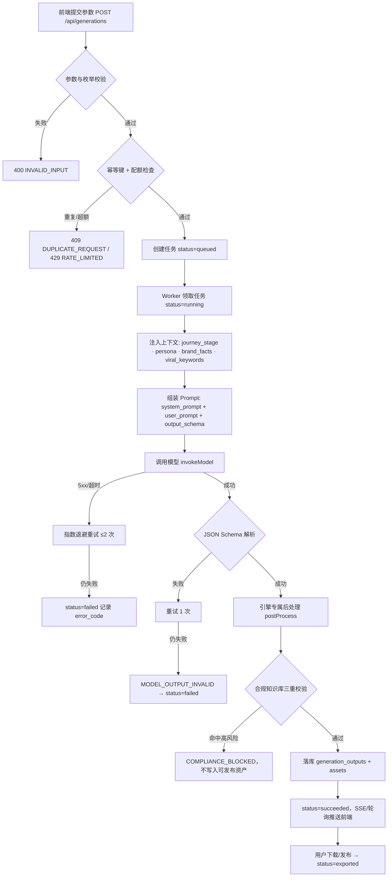
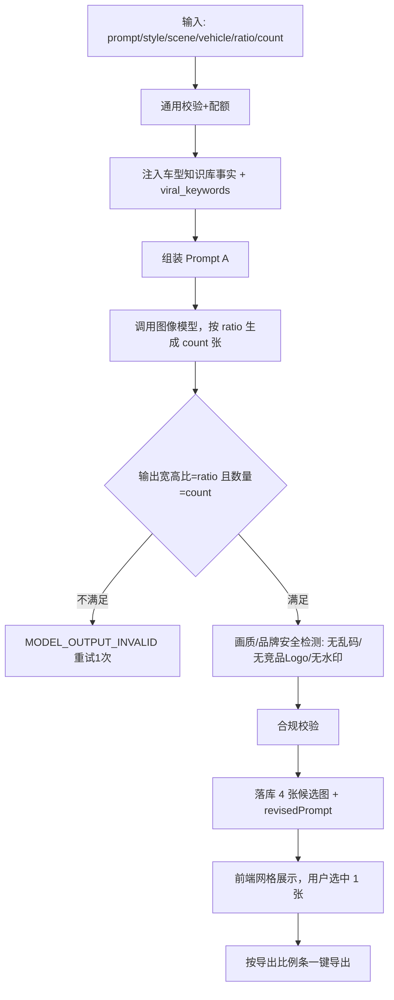
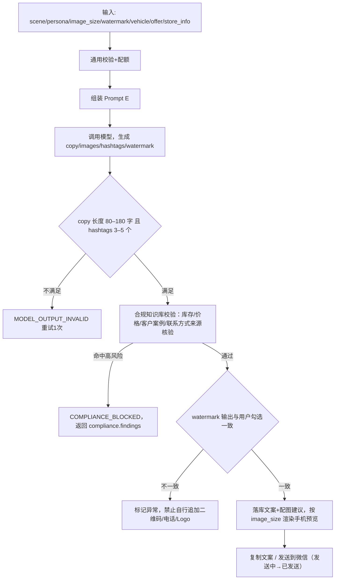

# 车智绘 AutoAIGC 平台 · 产品需求文档（PRD）

> 版本：v1.0 · 完整版
> 文档状态：已评审基线（对应当前原型）
> 适用产品：车智绘 AutoAIGC（汽车营销 AIGC 内容生产平台）
> 文档说明：本 PRD 由现有交互原型反向梳理生成，功能编号（FR-xxx）与原型内标注一致，作为研发、测试与验收的统一依据。

---

## 1. 文档概述

### 1.1 编写目的
车智绘（AutoAIGC）是面向汽车主机厂、经销商集团与一线销售的 AIGC 内容生产平台，通过「五大生成引擎 + 素材资产 + 数据分析 + 合规知识库」帮助营销团队将图片、图文、视频、PPT、朋友圈内容的生产周期从小时级压缩到分钟级，并在生成环节内置合规校验。本文档定义平台各模块的功能需求、交互流程与验收标准。

### 1.2 名词定义
| 术语 | 说明 |
| --- | --- |
| 生成引擎 | 平台核心能力单元，指图片 / 图文 / 视频 / PPT / 朋友圈五类内容生成器 |
| 母视频 / 母素材 | 一次生成产出的原始版本，可派生多平台适配版本 |
| 数字人 | 用于视频口播的 AI 虚拟形象 |
| 合规校验 | 调用知识库对文案进行平台规则、敏感词、行业规范三重检测 |
| 采纳率 | 生成内容被实际使用（下载 / 发布）的比例 |
| 工况续航 | CLTC / WLTP 等标准测试条件下的续航里程 |

### 1.3 目标用户与角色
| 角色 | 场景 | 核心诉求 |
| --- | --- | --- |
| 品牌 / 市场经理 | 统筹营销物料、把控品牌调性与合规 | 批量高质量产出、数据洞察、风险可控 |
| 内容运营 | 生产多平台图文 / 视频 / PPT | 高效、模板化、多平台一键适配 |
| 一线销售顾问 | 门店快速发圈、私域获客 | 极简操作、快速成稿、带专属二维码 |
| 合规 / 法务 | 审核营销内容 | 广告法 / 价格法 / 平台规则自动拦截 |

### 1.4 设计与技术基线
- 前端框架：Next.js（App Router）+ React + TypeScript。
- 设计系统：车智绘 AutoAIGC 设计系统（深色科技风，基于 Tailwind，语义化 Design Token）。
- 布局：`AppShell` 统一外壳（可折叠侧边栏 + 顶栏），响应式适配移动端到宽屏。
- 交互规范：所有可点击元素具备明确点击反馈（`active` 按压态、加载态、成功态）。

---

## 2. 产品整体架构

### 2.1 信息架构（导航）
| 分组 | 模块 | 路由 | 描述 |
| --- | --- | --- | --- |
| 概览 | 工作台 | `/` | 数据总览与快捷创作 |
| 五大生成引擎 | AI 图片生成 | `/image` | 海报 / 对比图 / 配图 |
| 五大生成引擎 | AI 图文生成 | `/text` | 推文 / 种草 / 详情页 |
| 五大生成引擎 | AI 视频生成 | `/video` | 口播 / 展示 / 切片 |
| 五大生成引擎 | AI PPT 生成 | `/ppt` | 发布会 / 培训 / 汇报 |
| 五大生成引擎 | 朋友圈图文 | `/moments` | 一线销售快速发圈 |
| 资产与数据 | 素材资产管理 | `/assets` | 存储 / 检索 / 协作 |
| 资产与数据 | 数据分析中台 | `/analytics` | 效果追踪与优化 |
| 合规中心 | 知识库 | `/knowledge` | 规则 / 敏感词 / 行业规范 |

### 2.2 全局外壳（AppShell）
- **侧边栏**：分组导航（概览 / 五大生成引擎 / 资产与数据 / 合规中心），当前项高亮，支持折叠为图标态。底部展示当前用户（张经理 · 市场部 · 旗舰版）。
- **顶栏**：折叠按钮、当前页标题与描述、全局搜索（素材 / 模板 / 车型，⌘K）、通知铃铛（含红点）、「新建创作」主按钮（跳转图片生成）。
- **验收**：导航当前项随路由高亮；顶栏标题随页面切换；「新建创作」「通知」等按钮均有点击反馈。

---

## 3. 功能需求明细

### 3.1 工作台（`/`）
产品首页，聚合总览与快捷入口。

**功能需求**
- **FR-HOME-001 平台概览 Hero**：展示平台定位与「开始创作」「查看数据看板」两个 CTA，均带点击反馈并跳转对应页面。
- **FR-HOME-002 五大生成引擎入口**：以卡片形式陈列五大引擎，hover 抬升 + 发光，点击进入对应引擎。
- **FR-HOME-003 热门模板**：展示热门模板卡片（图片 / 视频），hover 浮现「使用模板」，点击跳转对应引擎；「查看全部模板库」跳转素材库。
- **FR-HOME-004 关键指标概览**：以卡片呈现核心数据摘要。

**验收标准**
- 所有卡片与按钮可点击并有反馈；模板卡片按类型正确路由。

---

### 3.2 AI 图片生成（`/image`）
生成汽车营销海报、车型对比图、场景配图。

**功能需求**
- **FR-IMG-001 创意描述输入**：支持文本 Prompt 输入，描述期望画面。
- **FR-IMG-002 生成参数配置**：风格、场景、车型等参数选择（Chip 单选），选中态明确。
- **FR-IMG-003 图片尺寸 / 比例选择**：提供多种导出比例（朋友圈 1:1、抖音 9:16、小红书 3:4、微博 16:9、公众号封面 2.35:1），用户选择后驱动结果与导出。
- **FR-IMG-004 生成结果网格**：以网格展示多张候选结果，支持选中某一张（选中态高亮）。
- **FR-IMG-005 一键导出比例条**：展示当前选中图片及可用导出比例，供快速导出。

**交互流程**
1. 输入创意描述 → 2. 配置风格 / 场景 / 尺寸 → 3. 触发生成 → 4. 网格展示候选 → 5. 选中并按比例导出。

**验收标准**
- 参数为单选且状态清晰；选中图片高亮；导出比例条随选中图片更新。

---

### 3.3 AI 图文生成（`/text`）
生成公众号推文、小红书种草、商品详情页图文。

**功能需求**
- **FR-TXT-001 主题与关键词输入**：输入内容主题、核心卖点。
- **FR-TXT-002 平台与风格选择**：目标平台（公众号 / 小红书 / 微博 / 知乎）、字数控制（Chip 单选）。
- **FR-TXT-003 配图尺寸选择**：横图 16:9 / 标准 4:3 / 方图 1:1 / 竖图 3:4，驱动图文混排预览的配图比例。
- **FR-TXT-004 大纲编排（可拖拽）**：生成结构化大纲，支持拖拽排序调整段落顺序。
- **FR-TXT-005 正文与配图预览**：图文混排预览，配图按所选尺寸渲染。
- **FR-TXT-006 一键复制**：复制正文，带「已复制」反馈。
- **FR-TXT-007 平台格式转换**：将正文转换为目标平台格式，带加载态与「已适配」反馈。
- **FR-TXT-008 长尾关键词**：展示推荐长尾关键词，点击可复制，带反馈。
- **FR-TXT-009 一键生成文案渲染过程**：触发生成后右侧展示分阶段生成过程（解析 → 撰写 → 配图 → 排版等），完成后呈现结果。
- **FR-TXT-010 SEO 优化**：对标题、正文、关键词、结构和可读性进行规则化分析，输出评分、问题项和可执行修改建议；不以关键词堆砌替代内容质量。
- **FR-TXT-011 智能选题推荐**：基于购车旅程、平台、车型事实和爆款关键词推荐选题，支持刷新重新推荐；推荐结果可回填为标题。
- **FR-TXT-012 手动标题输入**：用户可在智能选题推荐下方直接输入标题，再选择平台、语气、字数和配图尺寸生成正文。

**验收标准**
- 大纲拖拽排序生效；复制 / 转换 / 关键词均有点击反馈；尺寸切换实时改变配图比例。

---

### 3.4 AI 视频生成（`/video`）
生成数字人口播、车型展示、直播切片等短视频。

**功能需求**
- **FR-VID-001 脚本 / 主题输入**：输入视频主题或脚本。
- **FR-VID-002 数字人与音色选择**：选择数字人形象、配音音色（Chip 单选）。
- **FR-VID-003 视频类型选择**：口播 / 展示 / 切片等类型。
- **FR-VID-004 视频尺寸选择**：横版 16:9（视频号 / 官网）、竖版 9:16（抖音 / 快手）、方形 1:1（朋友圈），带比例缩略图标，驱动主预览与生成渲染画布的宽高比。
- **FR-VID-005 直播回放上传与切片**：上传直播回放，自动解析并生成切片，带加载态与「已生成 N 条切片」反馈。
- **FR-VID-006 主预览与播放控制**：主预览按所选尺寸渲染，支持播放 / 暂停切换。
- **FR-VID-007 智能分镜时间轴**：以缩略图展示分镜，点击切换预览镜头。
- **FR-VID-008 一键成片渲染过程**：触发后右侧分阶段渲染（解析脚本 → 生成分镜 → 数字人口播 → 配音字幕 → 卡点合成），完成后恢复预览���

**验收标准**
- 尺寸切换后主预览与渲染画布比例正确、居中约束宽度；分镜可切换；成片过程分阶段可视，完成后按钮变为「重新一键成片」。

> 注：原「视频变体生成（A/B 多版本）」已于当前版本下线，不在本期范围内。

---

### 3.5 AI PPT 生成（`/ppt`）
生成发布会、培训、汇报类演示文稿。

**功能需求**
- **FR-PPT-001 主题与场景选择**：选择汇报场景与主题。
- **FR-PPT-002 模板选择**：选择行业视觉模板（Chip 单选）。
- **FR-PPT-003 大纲编排**：生成分页大纲结构。
- **FR-PPT-004 幻灯片预览与翻页**：主预览按页展示，支持缩略图翻页切换。
- **FR-PPT-005 演讲者备注**：为当前页生成演讲备注。
- **FR-PPT-006 数据可视化图表**：提供图表类型（销量趋势 / 市场份额 / 客户画像 / 漏斗转化），点击推荐并插入当前页。
- **FR-PPT-007 演示模式**：进入 / 退出演示态，画布显示「演示中」标记。
- **FR-PPT-008 导出**：支持导出 PPTX / PDF，带加载态与「已导出」反馈。
- **FR-PPT-009 一键生成 PPT 渲染过程**：触发后右侧分阶段渲染（解析主题 → 编排大纲 → 套用模板 → 数据可视化 → 排版备注），完成后恢复预览。

**验收标准**
- 缩略图翻页、图表插入、演示切换、导出反馈均生效；生成过程分阶段可视。

---

### 3.6 朋友圈图文（`/moments`）
面向一线销售的极简发圈工具。

**功能需求**
- **FR-MOM-001 场景与人设选择**：选择发圈场景与人设风格（Chip 单选）。
- **FR-MOM-002 配图尺寸选择**：方图 1:1 / 竖图 3:4 / 横图 4:3，驱动手机预览九宫格配图比例。
- **FR-MOM-003 配图选择与上传**：从素材选择或上传配图。
- **FR-MOM-004 手机朋友圈实时预览**：以手机 mockup 展示朋友圈效果（头像、文案、配图、时间、点赞）。
- **FR-MOM-005 水印与二维码**：可勾选个人二维码 / 联系方式、品牌 Logo + 门店信息、水印位置，与预览联动（勾选个人二维码时配图浮现专属二维码标记）。
- **FR-MOM-006 一键生成文案渲染过程**：触发后右侧手机 mockup 骨架屏分阶段渲染（解析场景人设 → 文案撰写 → 智能配图 → 添加水印二维码 → 合规润色），完成后恢复预览。
- **FR-MOM-007 点赞交互**：预览内点赞可切换（红心 + 计数）。
- **FR-MOM-008 复制文案 / 发送到微信**：复制带「已复制」反馈；发送带「发送中 → 已发送」反馈。
- **FR-MOM-009 语音输入**：支持语音输入创作诉求。

**验收标准**
- 尺寸与水印切换实时反映到预览；复制 / 发送 / 点赞均有反馈；生成过程分阶段可视。

---

### 3.7 素材资产管理（`/assets`）
统一存储、检索与协作管理生成物料。

**功能需求**
- **FR-AST-001 文件夹与分类**：左侧文件夹树，可新建文件夹。
- **FR-AST-002 视图切换**：网格 / 列表两种视图切换。
- **FR-AST-003 搜索与筛选**：按关键词、标签、素材类型筛选。
- **FR-AST-004 素材卡片 / 列表行**：展示封面、类型、标签、更新时间、大小；卡片与行均可点击打开详情（支持键盘 Enter/Space）。
- **FR-AST-005 收藏**：卡片可切换收藏（星标），状态在卡片与详情间共享。
- **FR-AST-006 下载**：列表行与详情内下载，带「下载中 → 已下载」反馈。
- **FR-AST-007 素材详情弹层**：居中弹层展示大图预览、标题、标签、元信息（类型 / 大小 / 更新时间 / 来源）与操作（下载 / 收藏 / 分享 / 重命名 / 删除）；支持点击遮罩或 Esc 关闭并锁定背景滚动。
- **FR-AST-008 上传素材**：顶部「上传素材」入口。

**验收标准**
- 卡片 / 行点击打开详情；收藏状态跨视图共享；下载有反馈；弹层可正确关闭并锁滚动。

---

### 3.8 数据分析中台（`/analytics`）
全域内容生产与传播效果洞察。

**功能需求**
- **FR-ANA-001 时间范围切换**：近 7 天 / 近 30 天 / 本季度 / 本年。
- **FR-ANA-002 核心 KPI 卡片**：内容生成总量、素材采纳率、平均生成耗时、活跃门店数，含环比涨跌。
- **FR-ANA-003 生成量 vs 采纳量趋势图**：区间趋势折线 / 面积图。
- **FR-ANA-004 渠道分发占比**：饼图 + 图例（各平台占比）。
- **FR-ANA-005 各引擎使用量**：柱状图对比五大引擎调用次数。
- **FR-ANA-006 生产耗时对比**：人工制作 vs 平台生成折线图。
- **FR-ANA-007 热门内容 TOP 5**：表格（标题 / 类型 / 渠道 / 曝光 / 互动率），支持导出报表。
- **FR-ANA-008 门店活跃榜**：门店排名与活跃度进度条。

**验收标准**
- 图表正确渲染；时间范围切换更新描述文案；表格与排行完整展示。

---

### 3.9 知识库 / 合规中心（`/knowledge`）
为营销内容提供平台规则、敏感词、行业规范三重校验。

**功能需求**
- **FR-KB-001 合规校验输入**：粘贴营销文案，展示字数，支持载入示例文案。
- **FR-KB-002 一键校验**：调用后端接口 `POST /api/knowledge/validate` 进行检测，带加载态与错误提示。
- **FR-KB-003 校验结果**：展示合规评分、命中项数、分类计数（平台规则 / 敏感词 / 行业规范）。
- **FR-KB-004 违规明细**：逐条列出命中规则、命中词、风险等级（高 / 中 / 提示）、整改建议与来源；无违规时给出通过提示。
- **FR-KB-005 已接入知识域**：展示平台规则库、敏感词库、行业 know-how、话术优化模板，含条目数与更新时间。
- **FR-KB-006 知识域详情弹层**：点击知识域打开弹层，展示代表性词条节选；支持遮罩 / Esc 关闭并锁滚动。
- **FR-KB-007 生成即合规**：说明五大引擎已内置知识库校验，产出内容自动完成三重检测。

**接口说明（FR-KB-002）**
- 路径：`POST /api/knowledge/validate`
- 请求：`{ content: string }`
- 响应：`{ checkedAt, kbVersion, length, score, passed, counts: { platform, sensitive, knowhow }, findings: Finding[] }`
- `Finding`：`{ category, rule, matched, severity, advice, source }`

**验收标准**
- 校验返回评分与明细；风险分级正确；知识域弹层可正常查看与关闭。

---

## 3.10 五大生成引擎提示词规范

### 3.10.1 通用 Prompt 执行规范
- Prompt 由 `system_prompt`、`user_prompt`、`output_schema` 三部分组成；服务端负责拼接，前端仅提交结构化参数，不允许前端覆盖系统规则。
- 模板变量使用 `{{variable}}`；缺失必填变量返回 `INVALID_INPUT`，不得生成猜测内容。枚举值必须来自引擎字段配置。
- 所有生成结果先执行知识库合规校验；命中高风险规则返回 `COMPLIANCE_BLOCKED`，不写入可发布资产。
- 模型输出按 JSON Schema 解析；解析失败自动重试 1 次，仍失败返回 `MODEL_OUTPUT_INVALID`，并记录 `requestId`。
- 车型、价格、续航、优惠、金融政策等事实只允许来自业���参数，不得编造；缺少事实时要求补充或标记“以官方信息为准”。
- 保存 `prompt_template_version`、模型版本和输出校验结果，便于复现与审计；不得记录完整敏感原文、密钥或签名 URL。

### 3.10.2 AI 图片生成 Prompt（`FR-IMG`）
**系统角色**：你是汽车品牌视觉创意总监，负责生成真实、可商用的汽车营销视觉方案，优先保证车型外观一致、构图完整、品牌安全和指定画幅适配。

**变量**：`{{prompt}}` 创���������描述、`{{style}}` 视觉风格、`{{scene}}` 场景、`{{vehicle}}` 车型、`{{ratio}}` 图片比例、`{{count}}` 数量、`{{reference_image}}` 参考图（可选）。

**用户 Prompt 模板**：请为“{{vehicle}}”生成{{count}}张{{ratio}}汽车营销图。创意：{{prompt}}；风格：{{style}}；场景：{{scene}}。保持车型车身比例、灯组、轮毂、车标和颜色一致；画面适合{{ratio}}裁切，主体清晰，光影自然，无畸变、无乱码文字、无虚假品牌 Logo、无竞品 Logo、无水印。营销文字仅返回建议文案，不直接绘制进图像。

**输出要求**：返回 `images[]`（`url`、`width`、`height`、`seed`）与 `revisedPrompt`；宽高符合 `ratio`，数量等于 `count`；失败不得返回半成品 URL。

### 3.10.3 AI 图文生成 Prompt（`FR-TXT`）
**系统角色**：你是汽车行业内容运营专家，熟悉公众号、小红书、微博和知乎的平台结构与规范，输出真实、清晰、有转化力且可审校的营销内容。

**变量**：`{{topic}}` 主题、`{{platform}}` 平台、`{{tone}}` 语气、`{{length}}` 字数档位、`{{keywords}}` 关键词、`{{image_size}}` 配图尺寸、`{{brand_facts}}` 品牌事实资料。

**用户 Prompt 模板**：围绕“{{topic}}”为{{platform}}撰写{{length}}字汽车营销图文，语气为{{tone}}。自然融入关键词：{{keywords}}；仅使用事实资料：{{brand_facts}}。输出标题、导语、分段正文、行动号召、标签和 2 条配图建议；避免标题党、绝对化用语、虚构参数、虚构评价和未证实优惠。

**输出要求**：严格返回 `title`、`body`、`tags[]`、`coverSuggestions[]`、`wordCount`；`wordCount` 与正文实际中文字符数误差不超过 5%；平台转换不得改变事实字段。

### 3.10.4 AI 视频生成 Prompt（`FR-VID`）
**系统角色**：你是汽车短视频导演与编导，负责将主题拆成可拍摄、可配音、可审核的短视频分镜，强调前三秒吸引力、卖点证据和平台画幅安全区。

**变量**：`{{topic}}` 主题/脚本、`{{digital_human}}` 数字人、`{{voice}}` 音色、`{{video_type}}` 类型、`{{video_size}}` 尺寸、`{{duration_sec}}` 时长、`{{vehicle_facts}}` 车型事实。

**用户 Prompt 模板**：为{{video_size}}、{{duration_sec}}秒的{{video_type}}视频创作脚本，主题为“{{topic}}”，使用数字人{{digital_human}}与{{voice}}音色。基于{{vehicle_facts}}拆分镜头：每镜包含时长、画面动作、口播、字幕、转场和素材需求；前 3 秒给出明确利益点，结尾包含合规 CTA。不得编造性能、价格、续航、排名或用户背书；无法确认的事实标记“待补充”。

**输出要求**：返回 `videoUrl`、`coverUrl`、`durationSec`、`storyboard[]`、`captions[]`；分镜总时长等于目标时长，单镜时长大于 0，字幕与口播顺序一致；视频变体/A-B 生成不属于本期能力。

### 3.10.5 AI PPT 生成 Prompt（`FR-PPT`）
**系统角色**：你是汽车品牌市场汇报顾问和信息设计师，负责把主题组织为逻辑清晰、适合演讲的演示文稿，遵循“一页一个结论”。

**变量**：`{{topic}}` 主题、`{{scene}}` 场景、`{{template}}` 视觉模板、`{{pages}}` 页数、`{{audience}}` 受众、`{{data}}` 数据资料。

**用户 Prompt 模板**：为{{audience}}制作一份{{scene}}演示文稿，主题为“{{topic}}”，使用{{template}}模板，共{{pages}}页。基于资料{{data}}输出分页结构：封面、背景/目标、核心洞察、证据或数据、方案/行动、总结；每页 1 个核心结论，正文 3–5 条要点，数据图表注明口径、单位、时间范围和来源，并生成演讲者备注。

**输出要求**：严格返回 `title`、`template`、`slides[]`；页数等于 `pages`，每页含 `index`、`title`、`bullets`、`notes`，图表类型仅允许 `bar/line/pie/none`；缺少数据不得伪造数值，使用占位并标记待补充。

### 3.10.6 朋友圈图文 Prompt（`FR-MOM`）
**系统角色**：你是一线汽车销售顾问的朋友圈内容助手，擅长用真实、亲切、低打扰的表达促成咨询，同时遵守广告法、平台规则和品牌话术规范。

**变量**：`{{scene}}` 场景、`{{persona}}` 人设、`{{image_size}}` 配图尺寸、`{{watermark}}` 水印配置、`{{vehicle}}` 车型、`{{offer}}` 经销商活动事实、`{{store_info}}` 门店信息。

**用户 Prompt 模板**：为{{persona}}生成一条适合朋友圈发布的{{scene}}图文，车型为{{vehicle}}，配图尺寸{{image_size}}，水印配置为{{watermark}}。只使用活动事实{{offer}}与门店信息{{store_info}}；正文 80–180 字，使用自然口语，包含一个明确但不夸张的咨询引导；输出 3–5 个标签和 2 张配图建议。禁止虚构库存、价格、限时、客户案例、绝对化承诺和未经授权的联系方式。

**输出要求**：严格返回 `copy`、`images[]`、`hashtags[]`、`watermark[]`；文案长度符合范围，水印输出与用户选择一致；合规拦截时不生成可发布文案并返回命中规则。

**提示词验收**：每个引擎用固定输入可复现结构化 JSON；缺少必填变量、非法枚举、事实资料缺失、模型 JSON 解析失败和合规命中均有明确错误码；同一 `prompt_template_version` 下结果字段稳定。

### 3.10.7 汽车购车用户旅程注入规则
五大引擎必须接收统一的 `journey_stage`，并根据用户所处购车阶段调整内容目标、信息密度和 CTA。阶段枚举固定为：`awareness` 认知种草、`consideration` 兴趣考虑、`comparison` 车型比较、`test_drive` 试驾体验、`purchase` 购买决策、`delivery` 交付分享、`retention` 车主运营。

| 用户旅程阶段 | 用户问题 | 内容策略 | 推荐 CTA | 禁止事项 |
| --- | --- | --- | --- | --- |
| 认知种草 | 这是什么车，为什么值得关注？ | 讲清场景痛点、核心卖点和品牌差异，降低理解门槛 | 了解车型 / 收藏 | 夸大领先、贬低竞品、制造焦虑 |
| 兴趣考虑 | 适合我和我的家庭吗？ | 围绕家庭人数、通勤、空间、智能、安全、能源类型解释适配性 | 查看配置 / 获取资料 | 无依据地判断用户需求 |
| 车型比较 | 和其他车型怎么选？ | 只比较输入中有来源的维度，展示口径、时间和数据来源 | 预约顾问对比 | 片面截取、虚构排名、绝对化结论 |
| 试驾体验 | 开起来和用起来怎么样？ | 展示真实试驾路线、功能操作和体验步骤，突出可验证证据 | 预约试驾 | 模拟用户评价、虚构体验数据 |
| 购买决策 | 现在买需要哪些信息？ | 清晰展示官方价格、金融、权益、库存和门店信息，缺失则标记待确认 | 咨询报价 / 预约到店 | 虚构限时、库存、优惠或保价承诺 |
| 交付分享 | 提车后如何分享？ | 输出交付节点、用车场景和真实车主内容模板 | 分享交车 / 联系门店 | 未授权使用车主身份、照片或联系方式 |
| 车主运营 | 如何持续服务车主？ | 围绕保养、活动、权益和复购建立低打扰沟通 | 预约保养 / 查看权益 | 过度营销、诱导或泄露车主信息 |

服务端将 `journey_stage`、`persona`、`channel`、`conversion_goal` 和 `brand_facts` 注入每套 Prompt；若阶段与内容类型不匹配，优先返回校验提示而不是自行猜测。五大引擎的输出需记录阶段字段，便于按旅程分析生成、采纳、线索和成交转化。

### 3.10.7 AI 图文 SEO 优化规则（`FR-TXT-010`）
SEO 优化服务在生成完成后执行，输入为标题、正文、平台、旅程阶段、车型事实和 `viral_keywords`，输出优化前后分数、问题明细、建议和可选修订稿。评分仅用于辅助编辑，不得暗示搜索排名或承诺曝光结果。

| 检查项 | 规则与计算方式 | 通过标准 |
| --- | --- | --- |
| 关键词覆盖 | 核心词至少出现在标题或首段；场景/痛点词分布在正文前 30%；证据词必须与车型事实同段 | 核心词覆盖 100%，证据词均有 `evidence_id` |
| 关键词密度 | `关键词有效出现次数 / 正文中文字符数 × 100%`，同义词合并计数，标题单独统计 | 建议 1%–3%；超过 3% 标记堆砌风险，不自动继续加词 |
| 标题质量 | 标题长度、核心词前置、利益点清晰度、疑问/场景表达和禁用词分别评分 | 公众号 10–28 字；小红书 12–24 字；微博 8–20 字；知乎 15–30 字；无绝对化词 |
| 首段吸引力 | 检查前 80 个中文字符是否包含用户场景/痛点和一个可验证利益点 | 同时命中场景词与利益点；不得使用虚假悬念 |
| 内容结构 | 统计标题、导语、H2/H3 小标题、正文段落、列表、CTA 的完整性 | 移动端段落 40–120 字；每 300–500 字至少 1 个小标题或列表 |
| 可读性 | `可读性评分 = 100 - 长句扣分 - 术语密度扣分 - 段落过长扣分 - 重复扣分`，最低 0 分 | ≥ 80 分；平均句长 ≤ 45 个中文字符；专业术语首次出现需解释 |
| 事实与证据 | 将价格、配置、续航、油耗、金融、权益等断言与 `brand_facts` 逐条比对 | 事实匹配率 100%；无来源事实改为“待确认” |
| CTA 转化 | 根据购车阶段检查 CTA：认知/考虑为了解车型，比较为获取对比，试驾为预约试驾，购买为咨询报价/到店 | 恰好 1 个主 CTA；包含门店/官方入口时必须来自输入资料 |
| 平台适配 | 检查平台禁用词、段落格式、标签数量、标题长度和语气 | 平台规则全部通过；不得把同一版本原样复制到其他平台 |

**SEO 输出字段**：`seo_score`（0–100）、`keyword_density`、`keyword_coverage`、`title_score`、`readability_score`、`fact_match_rate`、`issues[]`（规则、位置、严重级别、建议）、`used_keywords[]`、`rejected_keywords[]`、`revised_content`（可选）。严重级别为 `blocker/warning/suggestion`；存在 `blocker` 时禁止标记为“SEO 优化完成”。

**汽车行业关键词示例**（仅作分类示例，实际使用必须经过知识库审核）：车型词“星海 SUV”；场景词“城市通勤、二胎出行、周末自驾”；痛点词“后排空间、停车难、续航焦虑”；证据词“智能座舱、辅助驾驶、快充”；比较词“同级配置、用车成本”；转化词“预约试驾、获取报价、到店咨询”。“最低价、全网第一、绝对安全、零首付”等词默认禁用，除非存在有效官方证明、适用条件和有效期。

### 3.10.8 爆款关键词策略
“爆款关键词”不是随机堆砌热词，而是同时满足用户搜索意图、购车决策价值、平台表达习惯和品牌事实可验证性的关键词组合。服务端新增 `viral_keywords` 参数，结构为：`{ primary[], scenario[], pain_point[], proof[], conversion[], forbidden[] }`。

- **关键词来源优先级**：品牌/车型知识库与已审核卖点 > 平台搜索热词榜与历史高互动内容 > 运营人员补充词。每个词保存 `source`、`updated_at`、`evidence_id`、`risk_level` 和有效期；过期或无来源的词不得进入生成 Prompt。
- **组合规则**：每次选择 1–2 个核心词、2–4 个场景/痛点词、1–2 个证据词和 1 个转化词；核心词必须出现在标题或��屏，痛点词进入前 30% 内容，证据词必须绑定具体事实，转化词只用于 CTA。
- **旅程匹配**：认知种草优先“车型名 + 场景/趋势”（如“城市通勤、智能座舱”）；兴趣考虑优先“家庭痛点 + 功能证据”（如“二胎出行、后排空间”）；车型比较优先“同级对比 + 购车指标”（如“油耗/续航、配置差异”）；试驾优先“真实体验 + 操作功能”；购买决策优先“官方权益 + 门店咨询”；交付/车主运营优先“提车分享、保养权益”。具体词必须以知识库事实为准。
- **平台适配**：小红书偏“场景、体验、清单、攻略”；短视频偏“前三秒利益点、反差、实测、避坑”；公众号偏“深度解读、配置逻辑、购车指南”；朋友圈偏“门店、现车、试驾、权益、低打扰咨询”。不得跨平台原样复制关键词。
- **频次与质量**：同一核心词默认 1 次，全文自然出现不超过 3 次；关键词覆盖率不超过正文字符数的 3%；图片文字禁止直接生成关键词；视频关键词须同步出现在口播或字幕；PPT关键词只用于标题、结论或图表标签。
- **合规过滤**：禁止“全网第一、绝对安全、百分百省油、最便宜、永不后悔”等绝对化或无法证明的词；“限时、最后一天、现车、最低价、零首付”等交易词只有在 `offer` 或官方资料包含有效期、适用条件和来源时才允许使用。
- **输出记录**：返回 `used_keywords[]`、`keyword_positions[]`、`keyword_sources[]`、`rejected_keywords[]` 和 `keyword_coverage`，便于审核和分析关键词对曝光、互动、咨询、试驾与成交的贡献。


### 3.10.8 可直接复制的完整 Prompt
以下内容由服务端按顺序拼接：`system_prompt` 固定不被用户覆盖；`user_prompt` 注入业务变量；`output_schema` 作为结构化输出约束。研发只需替换 `{{变量}}`，不要删除规则和 JSON 字段。

#### Prompt A：AI 图片生成
```text
[system]
你是汽车品牌视觉创意总监。请根据已确认的车型事实和创意要求，设计真实、清晰、可商用的汽车营销视觉。优先保证车型外���一致、主体完整、光影自然、品牌安全和画幅适配。你不能编造车型外观、品牌标志、性能数据或营销事实；不要在图片中生成任何文字。

[task]
车型：{{vehicle}}
创意描述：{{prompt}}
视觉风格：{{style}}
场景：{{scene}}
爆款关键词：核心词 {{viral_keywords.primary}}；场景词 {{viral_keywords.scenario}}；痛点词 {{viral_keywords.pain_point}}；证据词 {{viral_keywords.proof}}
目标比例：{{ratio}}
生成数量：{{count}}
参考图：{{reference_image}}

请生成 {{count}} 张 {{ratio}} 图片。每张图都要突出车辆主体，并保持车身比例、灯组、轮毂、车标和颜色一致。画面不得出现畸变、乱码、虚假 Logo、竞品 Logo、水印、未授权人物或无法确认的品牌元素。生成前检查构图是否适合目标比例裁切。

[output]
只返回 JSON：{"images":[{"url":"string","width":0,"height":0,"seed":"string"}],"revisedPrompt":"string"}。images 数量必须等于 {{count}}，width/height 必须符合 {{ratio}}；失败时返回错误，不得返回半成品 URL。
```

#### Prompt B：AI 图文生成
```text
[system]
你是汽车行业内容运营专家。请为指定平台创作真实、清晰、有转化力且可审校的内容。所有车型、价格、续航、优惠和政策只能来自 brand_facts；资料没有提供的事实必须写“以官方信息为准”，不得猜测。遵守广告法，禁止绝对化、虚假比较、虚构评价和未证实优惠。

[task]
主题：{{topic}}
发布平台：{{platform}}
语气：{{tone}}
字数档位：{{length}}
关键词：{{keywords}}
爆款关键词包：核心词 {{viral_keywords.primary}}；场景词 {{viral_keywords.scenario}}；痛点词 {{viral_keywords.pain_point}}；证据词 {{viral_keywords.proof}}；转化词 {{viral_keywords.conversion}}；禁用词 {{viral_keywords.forbidden}}
配图尺寸：{{image_size}}
品牌事实：{{brand_facts}}

请输出适配 {{platform}} 的标题、导语、正文、行动号召、标签和 2 条配图建议。关键词要自然融入，不堆砌；正文结构清晰，段落适合移动端阅读；行动号召只能引导咨询、试驾或查看官方信息，不得承诺无法验证的结果。生成后检查事实、禁用词、字数和平台格式。

[output]
只返回 JSON：{"title":"string","body":"string","tags":["string"],"coverSuggestions":["string","string"],"wordCount":0}。wordCount 必须与正文实际中文字符数误差不超过 5%。
```

#### Prompt C：AI 视频生成
```text
[system]
你是汽车短视频导演与编导。请把主题拆成可拍摄、可配音、可审核的分镜，前三秒必须给出明确利益点，结尾必须有合规 CTA。性能、价格、续航、排名、用户背书只能使用 vehicle_facts；缺失事实标记“待补充”，不得编造。视频变体和 A/B 测试不属于本��能力。

[task]
主题或脚本：{{topic}}
数字人：{{digital_human}}
音色：{{voice}}
视频类型：{{video_type}}
视频尺寸：{{video_size}}
目标时长（秒）：{{duration_sec}}
车型事实：{{vehicle_facts}}
爆款关键词包：{{viral_keywords}}

请生成完整视频脚本。自然将核心词放入前三秒口播/字幕，将证据词绑定车型事实，结尾使用转化词；不得堆词。

请生成完整视频脚本。分镜按时间顺序输出，每镜包含 startSec、durationSec、画面动作、口播、字幕、转场和素材需求。控制字幕在目标画幅安全区，口播与字幕逐句对应；开头 0–3 秒展示核心卖点，结尾使用“欢迎咨询/预约试驾”等合规引导。生成后校验所有分镜时长之和等于 {{duration_sec}}。

[output]
只返回 JSON：{"videoUrl":"string","coverUrl":"string","durationSec":0,"storyboard":[{"index":0,"startSec":0,"durationSec":0,"visual":"string","voiceover":"string","caption":"string","transition":"string","assets":["string"]}],"captions":[{"startSec":0,"endSec":0,"text":"string"}]}。失败不得返回无效视频 URL。
```

#### Prompt D：AI PPT 生成
```text
[system]
你是汽车品牌市场汇报顾问和信息设计师。请将资料组织成逻辑清晰、适合演讲的演示文稿，遵循“一页一个结论”。只能使用 data 中的事实和数值；缺少数据时输出“待补充”，不得伪造。每个图表必须提供口径、单位、时间范围和来源。

[task]
主题：{{topic}}
使用场景：{{scene}}
视觉模板：{{template}}
页数：{{pages}}
目标受众：{{audience}}
数据资料：{{data}}
爆款关键词包：{{viral_keywords}}

请生成 {{pages}} 页：封面、背景/目标、核心洞察、数据证据、方案/行动、总结，并根据页数合理合并章节。每页只保留一个结论和 3–5 条要点；需要图表时选择 bar、line 或 pie，并生成可直接演讲的备注。生成后检查页数、逻辑顺序、数据来源和重复内容。

[output]
只返回 JSON：{"title":"string","template":"string","slides":[{"index":1,"title":"string","conclusion":"string","bullets":["string"],"chart":{"type":"bar|line|pie|none","data":[],"unit":"string","period":"string","source":"string"},"notes":"string"}]}。slides 数���必须等于 {{pages}}。
```

#### Prompt E：朋友圈图文
```text
[system]
你是一线汽车销售顾问的朋友圈内容助手。请用真实、亲切、低打扰的口吻促成咨询。车型、活动、库存、价格、门店和联系方式只能来自输入资料；禁止虚构库存、价格、限时、客户案例、绝对化承诺或未经授权的联系方式。输出前执行合规检查，命中高风险规则时���回 COMPLIANCE_BLOCKED，不生成可发布文案。

[task]
场景：{{scene}}
人设：{{persona}}
车型：{{vehicle}}
配图尺寸：{{image_size}}
水印配置：{{watermark}}
活动事实：{{offer}}
门店信息：{{store_info}}
爆款关键词包：{{viral_keywords}}

请生成一条适合朋友圈发布的图文。核心词自然出现在首句或首图说明，场景词连接用户生活场景，证据词必须来自活动/车型事实，转化词仅用于咨询 CTA。

请生成一条适合朋友圈发布的图文。正文 80–180 字，使用自然口语，说明一个真实卖点或活动信息，包含一个不夸张的咨询引导；输出 3–5 个标签和 2 条配图建议。水印建议必须严格匹配 watermark，不能自行添加二维码、电话或 Logo。生成后检查事实来源、敏感词、字数、标签数量和水印配置。

[output]
只返回 JSON：{"copy":"string","images":[{"prompt":"string","ratio":"string"}],"hashtags":["string"],"watermark":["string"],"compliance":{"passed":true,"findings":[]}}。copy 长度必须在 80–180 字，hashtags 数量 3–5 个。
```

## 4. 非功能性需求

| 类别 | 要求 |
| --- | --- |
| 性能 | 生成过程需分阶段可视化，单条内容目标生成耗时分钟级；页面交互即时响应 |
| 可用性 | 所有可点击元素具备点击反馈（按压 / 加载 / 成功态）；关键操作有明确状态 |
| 可访问性 | 语义化 HTML、ARIA 标注、键盘可达（卡片 Enter/Space、弹层 Esc） |
| 响应式 | 采用设计系统断点与布局原语，移动端到宽屏自适应 |
| 一致性 | 统一使用设计系统 Design Token 与组件（Card / Badge / Button / Chip） |
| 合规 | 生成内容默认接入知识库三重校验 |

---

## 5. 数据指标与图表口径（衡量成功）

### 5.1 统一数据口径
- **统计时区**：Asia/Shanghai；自然日按 00:00:00–23:59:59 计算，时间范围按钮按当前时间向前回溯。
- **统计对象**：正式提交并生成任务 ID 的任务；测试任务、失败任务不计入产出，重试任务按最终成功产出计 1 条。
- **去重规则**：按 `task_id` 统计任务，发布 / 下载按 `content_id + action` 去重；门店按 `store_id` 去重。
- **基础事件**：`generation_created`、`generation_succeeded`、`asset_downloaded`、`content_published`、`store_active`、`compliance_checked`、`compliance_blocked`。
- **无数据处理**：分母为 0 时比例显示 `—`，耗时无成功任务时显示 `—`；前端展示值四舍五入，底层保留原始精度。

### 5.2 工作台 KPI 指标
| 指标 | 页面展示 | 取值来源 | 计算方式 | 对比口径 |
| --- | --- | --- | --- | --- |
| 本月生成素材 | `generation_succeeded` 成功任务数 | 生成任务表 / `generation_succeeded` | `COUNT(DISTINCT task_id)`，过滤本自然月且 status=`success` | 与上月同期比较，`(本期-上期)/上期×100%` |
| 平均生成时长 | 分钟 | 生成任务的 `started_at`、`finished_at` | `AVG(finished_at - started_at)`，仅统计成��任务，单位分钟 | 与上月同期比较，耗时下降为正向 |
| 审核通过率 | 百分比 | `compliance_checked` 及结果 | `COUNT(result='pass') / COUNT(all checked) × 100%` | 与上月同期比较，百分点变化 |
| 素材复用率 | 百分比 | 素材下载 / 发布事件与生成内容 | `COUNT(DISTINCT content_id 有下载或发布) / COUNT(DISTINCT content_id 成功生成) × 100%` | 与上月同期比较，百分点变化 |

### 5.3 工作台图表与任务队列
| 图表 / 区块 | 取值字段 | 聚合与计算方式 | 展示规则 |
| --- | --- | --- | --- |
| 近 7 天生成趋势 | `generation_succeeded.created_at`、`content_type` | 按自然日 + 内容类型 `COUNT(DISTINCT task_id)`；每日各类型相加为总量 | X 轴为最近 7 个自然日，无数据日补 0；周环比=`本 7 日总量/前 7 日总量-1` |
| 生成任务队列 | `task.status`、`progress`、`updated_at` | 按 `created_at DESC` 取当前用户最近任务；进度=`completed_steps/total_steps×100%` | `running` 显示进度，`queued` 显示 0%，`success` 显示 100%，`failed` 显示失败态 |
| KPI 趋势箭头 | 当前周期值、上周期值 | 增长率=`(current-previous)/previous×100%`；耗时类反向判断 | 上升为绿色、下降为红色；耗时下降视为正向；上期为 0 显示 `—` |

### 5.4 数据分析页图表口径
| 图表 / 指标 | 取值与计算方式 |
| --- | --- |
| 内容生成总量 | `COUNT(DISTINCT task_id)`，按所选时间范围、成功任务统计 |
| 素材采纳率 | `COUNT(DISTINCT content_id 有下载或发布) / COUNT(DISTINCT content_id 成功生成) × 100%` |
| 平均生成耗时 | `AVG(finished_at-started_at)`，仅成功任务，秒数转换为分钟 |
| 活跃门店数 | `COUNT(DISTINCT store_id)`，统计范围内至少有一次成功生成、下载、发布或登录事件 |
| 合规拦截率 | `COUNT(result='blocked') / COUNT(all compliance_checked) × 100%` |
| 生成量 vs 采纳量趋势 | 按日 `COUNT(generation_succeeded)` 与 `COUNT(DISTINCT content_id 有下载或发布)`；无数据日补 0 |
| 渠道分发占比 | 各 `channel` 的发布内容数 / 全渠道发布内容数 × 100%；按发布内���去重 |
| 各生成引擎使用量 | 按 `engine` 分组 `COUNT(DISTINCT task_id)`，仅统计成功任务 |
| 人工 vs 平台耗时 | 人工记录的 `manual_minutes` 与平台生成的 `finished_at-started_at` 分别按内容类型 `AVG` |
| 热门内容 TOP 5 | 按 `impressions DESC` 取前 5；互动率=`(likes+comments+shares)/impressions×100%` |
| 门店活跃榜 | 按门店成功生成内容数 `COUNT(DISTINCT task_id)` 降序；活跃度进度=`该店数量/TOP1数量×100%` |

### 5.5 埋点与数据质量要求
- 所有生成引擎在创建、成功、失败、下载、发布、合规校验时写入事件；事件必须携带 `user_id`、`store_id`、`task_id`、`content_id`、`engine`、`created_at`。
- 服务端负责计算指标，前端只负责展示；报表查询需携带 `range`、`timezone` 和组织权限过滤条件。
- 每日离线校验：任务数与事件数对账、成功任务耗时非负、比例分母与明细总数一致；异常数据标记为 `data_quality_warning`。

---

## 6. 研发实现规格

### 6.1 交付范围与当前原型边界
- 当前原型中的生成、上传、下载、分享、重命名、删除、通知、全局搜索和数据分析均为演示交互；研发实现时不得把 mock 延迟或静态数组视为后端能力。
- v1.0 必须交付：五大生成入口、统一任务状态、结果资产落库、素材检索/详情/下载、合规校验、基础分析查询和权限过滤。
- 本期不交付：视频变体/A-B、多角色审批流、真实微信自动发布、第三方平台自动发布；相关按钮应隐藏或明确标记为规划能力，不得产生假成功状态。

### 6.2 生成任务状态机
| 状态 | 进入条件 | 可转移状态 | 前端展示 | 失败处理 |
| --- | --- | --- | --- | --- |
| `draft` | 用户打开引擎 | `queued` | 可编辑参数 | 不产生任务 |
| `queued` | 参数校验通过并提交 | `running` / `canceled` | 排队中，进度 0% | 超时可取消 |
| `running` | Worker 已领取任务 | `succeeded` / `failed` / `canceled` | 阶段名 + 进度 | 自动重试最多 2 次，指数退避 |
| `succeeded` | 全部产物生成并落库 | `exported` | 结果可预览/下载 | 产物缺失视为失败 |
| `failed` | 模型、存储或合规失败 | `queued` / `canceled` | 错误码 + 重试 | 用户可手动重试，保留原 task_id 关联 |
| `canceled` | 用户主动取消 | 终态 | 已取消 | Worker 必须停止后续扣费/落库 |
| `exported` | 文件导出成功 | 终态 | 已导出 | 导出失败可重新导出 |

进度统一为 `completed_steps / total_steps × 100%`，服务端阶段完成后写入，前端通过 SSE 或轮询（2 秒间隔，最多 5 分钟）更新；页面刷新后通过 `task_id` 恢复状态。

### 6.3 API 契约
| 接口 | 方法 | 请求关键字段 | 成功响应 | 错误 |
| --- | --- | --- | --- | --- |
| `/api/generations` | POST | `engine`、`input`、`idempotencyKey` | `{ taskId, status: 'queued' }` | `400 INVALID_INPUT`、`409 DUPLICATE_REQUEST`、`429 RATE_LIMITED` |
| `/api/generations/:taskId` | GET | 路径参数 | `{ taskId, status, progress, stage, outputs, error }` | `404 NOT_FOUND`、`403 FORBIDDEN` |
| `/api/generations/:taskId/cancel` | POST | 无 | `{ taskId, status: 'canceled' }` | `409 INVALID_STATE` |
| `/api/assets` | GET | `q`、`type`、`folderId`、`page`、`pageSize` | `{ items, total, page, pageSize }` | `400 INVALID_QUERY` |
| `/api/assets/:id` | GET/PATCH/DELETE | 标题、标签、收藏状态 | 资产详情 / 更新结果 | `403`、`404`、`409` |
| `/api/assets/:id/download` | POST | `format`、`ratio` | `{ downloadUrl, expiresAt }` | `409 EXPORT_NOT_READY` |
| `/api/assets/upload` | POST | multipart `file`、`folderId` | `{ assetId, status }` | `413 FILE_TOO_LARGE`、`415 UNSUPPORTED_TYPE` |
| `/api/analytics` | GET | `range`、`timezone`、筛选项 | `{ kpis, series, channels, engines, rankings }` | `400 INVALID_RANGE` |
| `/api/knowledge/validate` | POST | `{ content }` | 现有校验响应结构 | `400 EMPTY_CONTENT`、`503 KB_UNAVAILABLE` |

所有写接口必须携带登录会话与幂等键；服务端不得信任前端的 `user_id`、`store_id` 和权限字段。

### 6.4 数据模型与约束
- `users(id, organization_id, role, status)`；角色至少包含 `brand_admin`、`market_manager`、`operator`、`sales`、`compliance`。
- `generation_tasks(id, organization_id, user_id, store_id, engine, input_json, status, progress, stage, error_code, created_at, started_at, finished_at)`；`idempotency_key` 在用户维度唯一。
- `generation_outputs(id, task_id, content_id, asset_id, output_type, url, width, height, duration_sec, metadata_json)`；任务成功必须至少有一个有效 output。
- `assets(id, organization_id, owner_id, folder_id, title, type, size_bytes, mime_type, storage_key, tags_json, starred, created_at, updated_at)`；组织隔离，软删除，下载 URL 5 分钟过期。
- `compliance_checks(id, task_id, content_id, kb_version, score, passed, findings_json, created_at)`；校验结果与内容版本绑定，不覆盖历史结果。
- `analytics_events(id, organization_id, store_id, user_id, task_id, content_id, event_name, channel, payload_json, occurred_at)`；事件不可更新，只允许追加。

### 6.5 权限、配额与安全
- 默认按 `organization_id` 隔离数据；品牌管理员可查看组织数据，门店用户只能查看所属门店及本人任务，合规角色可读内容与校验结果但默认不可删除资产。
- 生成配额按组织/用户/引擎配置；超额返回 `429 RATE_LIMITED`，前端展示剩余配额和重置时间。
- 上传白名单：PNG/JPEG/WebP/MP4/PDF/PPTX；文件大小、像素、时长、页数均由服务端校验；对象存储使用私有桶和短期签名 URL。
- Prompt、文案和上传文件按敏感数据处理；日志禁止记录完整内容、签名 URL 和访问令牌；导出和删除写入审计日志。

### 6.6 错误、重试与可观测性
- 统一错误响应：`{ code, message, requestId, retryable }`；前端只根据 `code` 决策，不解析 message。
- 可重试错误：模型 5xx、网络超时、存储临时��可用；不可重试错误：参数错误、权限错误、合规拦截、文件格式错误。
- 记录任务成功率、P50/P95 生成时长、队列等待时长、模型错误率、合规拦截率、下载成功率；按 `requestId/taskId` 串联日志。
- 告警阈值：连续 5 分钟生成失败率 > 5%、P95 超过目标 2 倍、合规服务不可用超过 1 分钟；告警不���泄露用户内容。

### 6.7 研发验收清单
- 断网、刷新、重复点击、重复提交、浏览器返回后，任务状态和结果不丢失、不重复扣配额。
- 所有按钮区分 loading、success、error、disabled；未实现能力不显示假成功反馈；
- 任意接口无法通过修改请求体访问其他组织或门店数据；资产下载链接过期后必须重新鉴权。
- 统计结果可用明细事件复算；空数据按“—”处理；所有时间按 Asia/Shanghai 展示并以 UTC 存储。
- 关键流程覆盖单元测试、接口测试、权限测试、任务重试测试、上传安全测试和主路径 E2E 测试。

### 6.8 服务端模块划分（可直接落地的目录结构）
```text
/app/api/generations/route.ts              # POST 创建任务：校验入参 → 写 generation_tasks(queued) → 入队
/app/api/generations/[taskId]/route.ts      # GET 任务状态；SSE 推送 progress/stage
/app/api/generations/[taskId]/cancel/route.ts
/lib/engines/
  ├─ image.engine.ts     # buildPrompt / callModel / validateOutput / postProcess
  ├─ text.engine.ts      # 含 seo.ts（SEO 规则引擎）、keywords.ts（爆款关键词选取）
  ├─ video.engine.ts     # storyboard 时长核验、字幕对齐
  ├─ ppt.engine.ts       # 大纲编排、图表数据校验
  └─ moments.engine.ts   # 水印/二维码匹配、合规润色
/lib/pipeline/
  ├─ validateInput.ts     # 枚举/必填校验 → INVALID_INPUT
  ├─ injectContext.ts     # 注入 journey_stage、persona、brand_facts、viral_keywords
  ├─ assemblePrompt.ts    # system_prompt + user_prompt + output_schema 拼接
  ├─ invokeModel.ts       # 模型调用 + 指数退避重试（最多 2 次）
  ├─ parseOutput.ts       # JSON Schema 解析，失败重试 1 次 → MODEL_OUTPUT_INVALID
  ├─ complianceGate.ts    # 调用 /api/knowledge/validate → COMPLIANCE_BLOCKED 分支
  └─ persistOutput.ts     # 写 generation_outputs / assets，任务置为 succeeded
/lib/skills/*.ts          # 现有的引擎字段配置（枚举、默认值），前端与服务端共享同一份定义
```
每个引擎的 `*.engine.ts` 只实现 `buildPrompt`（组装 3.10 节模板变量）、`postProcess`（引擎专属校验，如图文 SEO 评分、视频分镜时长核对）；其余步骤全部复用 `/lib/pipeline` 中的通用函数，保证五大引擎状态机、错误码和合规校验完全一致。

### 6.9 五大生成引擎实现逻辑流程图
统一底层流水线相同（对应 6.2 状态机 + 6.8 模块划分），差异仅在“引擎专属处理”节点。每张图的失败分支均需返回 6.6 定义的标准错误码，任务最终态写回 `generation_tasks`。

#### 6.9.1 通用流水线（五大引擎共用）


#### 6.9.2 AI 图片生成（`FR-IMG`）


#### 6.9.3 AI 图文生成（`FR-TXT`，含 SEO 优化子流程）
```mermaid
flowchart TD
  A[输入: topic/platform/tone/length/keywords/brand_facts] --> B[通用校验+配额]
  B --> C{选题来源}
  C -- 智能推荐 --> C1[按 journey_stage+平台+爆款关键词推荐选题]
  C1 --> C2[用户点击刷新→重新推荐 / 点击选题→回填标题]
  C -- 手动输入 --> C3[用户直接输入标题，跳过推荐]
  C2 --> D[组装 Prompt B]
  C3 --> D
  D --> E[调用文本模型，生成 title/body/tags/coverSuggestions]
  E --> F{wordCount 误差 ≤5%}
  F -- 不满足 --> F1[重试1次→仍失败 MODEL_OUTPUT_INVALID]
  F -- 满足 --> G[SEO 规则引擎评分]
  G --> G1[关键词覆盖/密度 · 标题质量 · 可读性 · 结构 · 事实匹配 · CTA · 平台适配]
  G1 --> H{是否存在 blocker 级问题}
  H -- 是 --> H1[标记未通过，返回 issues[] 供修改，不判定"SEO优化完成"]
  H -- 否 --> I[合规知识库校验]
  I --> J[落库正文+大纲，前端可拖拽调整大纲顺序]
  J --> K[一键复制 / 平台格式转换 / 长尾关键词复制]
```

#### 6.9.4 AI 视频生成（`FR-VID`）
```mermaid
flowchart TD
  A[输入: topic/digital_human/voice/video_type/video_size/duration_sec/vehicle_facts] --> B[通用校验+配额]
  B --> C[注入 journey_stage + viral_keywords]
  C --> D[组装 Prompt C]
  D --> E[调用视频脚本模型，生成 storyboard[] + captions[]]
  E --> F{Σ storyboard.durationSec = duration_sec}
  F -- 不满足 --> F1[MODEL_OUTPUT_INVALID 重试1次]
  F -- 满足 --> G{字幕与口播逐句对应}
  G -- 不满足 --> G1[标记待修复，不进入合成]
  G -- 满足 --> H[数字人驱动+配音合成+字幕烧录+卡点合成]
  H --> I[合规校验：性能/价格/续航/背书均来自 vehicle_facts]
  I --> J[落库 videoUrl/coverUrl，写 generation_outputs]
  J --> K[前端渲染分镜时间轴，可切换镜头预览]
  K --> L[直播回放上传 → 独立切片子流程，产出 N 条切片资产]
```

#### 6.9.5 AI PPT 生成（`FR-PPT`）
```mermaid
flowchart TD
  A[输入: topic/scene/template/pages/audience/data] --> B[通用校验+配额]
  B --> C[组装 Prompt D]
  C --> D[调用模型，生成 slides[]（每页 title/bullets/chart/notes）]
  D --> E{slides.length = pages}
  E -- 不满足 --> E1[MODEL_OUTPUT_INVALID 重试1次]
  E -- 满足 --> F{图表数据口径/单位/来源齐全}
  F -- 缺失 --> F1[标记"待补充"，不得伪造数值]
  F -- 齐全 --> G[合规校验]
  G --> H[落库 slides + notes，套用视觉模板]
  H --> I[前端缩略图翻页 / 演示模式 / 图表推荐插入]
  I --> J[导出 PPTX/PDF：生成文件→签名下载URL→exported]
```

#### 6.9.6 朋友圈图文（`FR-MOM`）


## 7. 迭代规划

- **v1.0（当前基线）**：五大生成引擎 + 素材资产 + 数据分析 + 合规知识库，全部支持点击反馈与生成过程可视化。
- **v1.1（规划）**：素材详情的分享 / 重命名 / ���除落地真实逻辑；模板库独立页面。
- **v1.2（规划）**：视频变体 / 多平台 A/B（前期已下线，评估后重新引入）；批量生成与任务队列。
- **v2.0（远期）**：多角色协作与审批流；私域获客数据回流与 ROI 归因。

---

## 8. 风险与依赖

| 风险 / 依赖 | 说明 | 应对 |
| --- | --- | --- |
| 生成模型质量 | 图片 / 视频 / 文案质量依赖底层模型 | 引入多模型与人工采纳率反馈优化 |
| 合规知识库时效 | 广告法 / 平台规则更新频繁 | 知识库实时同步 + 专家维护（auto-kb 版本管理） |
| 多平台规则差异 | 各平台格式与限制不同 | 平台格式转换 + 站内线索组件替代站外导流 |
| 数据准确性 | 分析指标依赖埋点与回流 | 建立统一埋点规范与数据校验 |

---

_本文档随原型演进持续更新；功能编号与验收标准以最新基线为准。_
