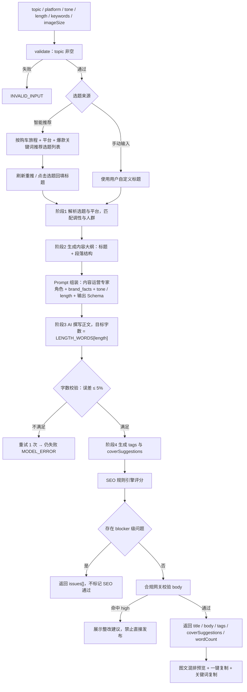
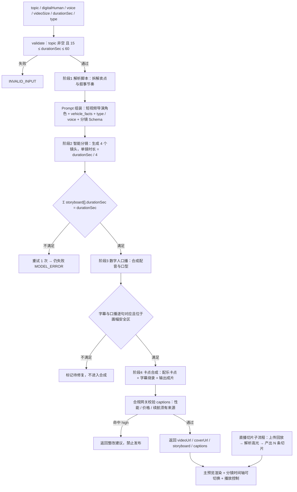
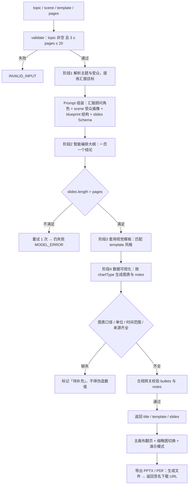
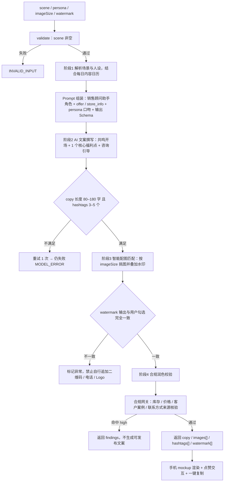

```mermaid
flowchart TD
  A[prompt / style / ratio / count / referenceImage] --> B["validate：prompt 非空 且 1 ≤ count ≤ 8"]
  B -- 失败 --> B1[INVALID_INPUT 表单提示]
  B -- 通过 --> C["createTaskId&#40;'image'&#41;"]
  C --> D[阶段1 解析创作描述：提取车型 / 场景 / 卖点]
  D --> E[阶段2 匹配视觉风格：套用风格与色调]
  E --> F["Prompt 组装：视觉总监角色 + 车型事实 + style / ratio + 输出 Schema"]
  F --> G[阶段3 扩散模型并行生成 count 张]
  G --> H{"校验：数量 = count 且 尺寸 = RATIO_SIZE[ratio]"}
  H -- 不满足 --> H1[重试 1 次 → 仍失败 MODEL_ERROR]
  H -- 满足 --> I[阶段4 超分放大并按比例裁切]
  I --> J[品牌安全检测：无乱码文字 / 无虚假或竞品 Logo / 无畸变]
  J -- 不通过 --> J1[剔除问题图，不足数量时补生成]
  J -- 通过 --> K["返回 images[] + revisedPrompt = `${style}风格 · ${prompt}`"]
  K --> L[网格渲染 → 用户选中 → 下载 / 收藏 / 自动入库]
```

# 车智绘 AutoAIGC · 产品需求文档（PRD v2.0）

> **本版本为全量重写版。此前所有 PRD 版本（v1.x）即日作废**，不再作为开发、测试与验收依据。
> 编写原则：所有接口、类型、枚举、校验规则、AI 调用逻辑均与代码库真实实现一一对应（`lib/skills/*`、`app/api/*`、`lib/nav.ts`），研发可直接据此实现，无需二次澄清。

| 项目 | 内容 |
| --- | --- |
| 产品名称 | 车智绘 AutoAIGC · 汽车行业 AI 营销内容生成平台 |
| 文档版本 | v2.0（全量重写，v1.x 作废） |
| 技术栈 | Next.js 16 (App Router) · React 19 · TypeScript · Tailwind v4 · @base-ui/react · Recharts |
| 代码基线 | `app/`（9 个路由）· `lib/skills/`（5 引擎 Skill 契约）· `app/api/knowledge/validate`（合规网关） |
| 文档定位 | 产品 / 研发 / 测试 / 设计的唯一需求与验收依据 |

---

## 1. 产品定位与目标用户

### 1.1 产品定位
面向汽车主机厂、经销商集团、4S 门店与一线销售顾问的 **AI 营销内容生成平台**。通过五大生成引擎，把原本需要设计、文案、剪辑多角色协作数小时的内容生产压缩到分钟级，并在生成链路内置汽车行业合规知识库，实现「即生成、即合规」。

### 1.2 目标用户与核心诉求

| 角色 | 典型场景 | 核心诉求 |
| --- | --- | --- |
| 主机厂市场部 | 新车上市、节点大促 | 统一品牌调性，批量产出多平台素材 |
| 经销商集团市场负责人 | 区域活动、经营汇报 | 快速产出 PPT / 海报，掌握门店内容效果 |
| 4S 店新媒体运营 | 公众号 / 小红书 / 抖音日更 | 低成本高频更新，平台调性自动适配 |
| 一线销售顾问 | 每日朋友圈获客 | 3 步出图出文，带个人二维码，不违规 |
| 合规 / 法务 | 内容风控 | 广告法、平台规则、行业规范三重自动拦截 |

### 1.3 名词定义

| 术语 | 说明 |
| --- | --- |
| 生成引擎 / Skill | 平台核心能力单元，指图片 / 图文 / 视频 / PPT / 朋友圈五类生成器，统一实现 `Skill` 接口 |
| taskId | 单次生成任务唯一标识，格式 `{skillId}_{base36时间戳}_{6位随机}`，失败也必须返回 |
| 合规网关 | `POST /api/knowledge/validate`，对文本产出执行平台规则 / 敏感词 / 行业规范三重检测 |
| 购车旅程阶段 | `journey_stage`，决定内容目标、信息密度与 CTA 类型 |
| 爆款关键词 | 同时满足搜索意图、决策价值、平台习惯与事实可验证性的关键词组合 |
| 采纳率 | 生成内容被实际下载或发布的比例 |

### 1.4 产品价值指标

| 指标 | 现状（人工） | 目标（平台） |
| --- | --- | --- |
| 单条图文生产耗时 | 90–120 分钟 | ≤ 5 分钟 |
| 单条短视频生产耗时 | 240–480 分钟 | ≤ 15 分钟 |
| 内容合规检测覆盖率 | 人工抽检 | 100% 自动三重校验 |
| 素材复用率 | < 20% | ≥ 60% |

---

## 2. 全局信息架构与布局

导航配置的唯一来源为 `lib/nav.ts` 的 `navGroups`，新增页面必须同步注册，禁止在页面内硬编码导航。

```text
车智绘 AutoAIGC
├─ 概览
│   └─ /              工作台          数据总览与快捷创作            FR-HOME
├─ 五大生成引擎
│   ├─ /image         AI 图片生成      海报 / 对比图 / 配图          FR-IMG
│   ├─ /text          AI 图文生成      推文 / 种草 / 详情页          FR-TXT
│   ├─ /video         AI 视频生成      口播 / 展示 / 切片            FR-VID
│   ├─ /ppt           AI PPT 生成      发布会 / 培训 / 汇报          FR-PPT
│   └─ /moments       朋友圈图文       一线销售快速发圈              FR-MOM
├─ 资产与数据
│   ├─ /assets        素材资产管理     存储 / 检索 / 协作            FR-AST
│   └─ /analytics     数据分析中台     效果追踪与优化                FR-ANA
├─ 合规中心
│   └─ /knowledge     知识库           规则 / 敏感词 / 行业规范      FR-KB
└─ 文档
    └─ /prd           产品需求文档     PRD · 需求与验收              FR-DOC
```

### 2.1 全局外壳 AppShell（`components/app-shell.tsx`）
- 布局为「左侧固定侧边栏 + 右侧内容区」；侧边栏按 `navGroups` 分组渲染，当前路由高亮，底部展示当前用户身份。
- 顶部为 `sticky` header，展示当前页面标题与描述。**右侧操作区当前为空**——通知铃铛与「新建创作」按钮已按设计决策移除，后续如需恢复须走需求变更。
- 移动端侧边栏折叠为抽屉，由 header 菜单按钮控制。
- 主内容区统一内边距，内部使用居中最大宽度容器。

---

## 3. AI 调用总体架构

本章为全文核心。所有 AI 能力通过统一的 **Skill 契约**暴露，页面不得直连模型。

### 3.1 分层架构

```text
┌─────────────────────────────────────────────────────────┐
│ 表现层  app/{image,text,video,ppt,moments}/page.tsx      │
│  · 由 skill.fields 驱动参数表单                           │
│  · 由 skill.stages 驱动生成阶段动效                       │
│  · 消费 SkillResult，渲染结果或错误分支                    │
└──────────────────────────┬──────────────────────────────┘
                           │ runSkill(id, input)
┌──────────────────────────▼──────────────────────────────┐
│ 调度层  lib/skills/index.ts                              │
│  · skills 注册表（image/text/video/ppt/moments）          │
│  · getSkill(id) / runSkill(id, input) 动态调度            │
│  · skillList 供导航、文档、选择器复用                      │
└──────────────────────────┬──────────────────────────────┘
┌──────────────────────────▼──────────────────────────────┐
│ 引擎层  lib/skills/*-skill.ts                            │
│  · meta / fields / stages / validate() / run()           │
└──────────────────────────┬──────────────────────────────┘
┌──────────────────────────▼──────────────────────────────┐
│ 模型层（run 内部，当前为 mock，对外契约不变）              │
│  Prompt 组装 → 模型调用 → Schema 解析 → 硬约束校验         │
│  → 合规网关 → 返回 SkillResult                            │
└─────────────────────────────────────────────────────────┘
```

**关键设计约束**：`run()` 当前为 mock（`simulateLatency` + 贴近真实的示例数据）。接入真实模型时**只替换 `run()` 内部实现，调用方代码零改动**——这是全平台接入真实 AI 的唯一改造点。

### 3.2 统一 Skill 契约（`lib/skills/types.ts`）

```ts
export type SkillId = 'image' | 'text' | 'video' | 'ppt' | 'moments'

export interface Skill<TInput, TOutput> {
  meta: SkillMeta          // 引擎元信息
  fields: SkillField[]     // 入参字段描述（驱动表单 / 校验 / 文档）
  stages: SkillStage[]     // 生成阶段（驱动 loading 动效）
  validate: (input: Partial<TInput>) => string[]   // 返回空数组代表通过
  run: (input: TInput) => Promise<SkillResult<TOutput>>
}

export interface SkillMeta {
  id: SkillId
  name: string
  description: string
  route: string        // 对应前端路由
  frPrefix: string     // 需求编号前缀，与本文档对应
  estimatedMs: number  // 预计耗时，用于前端进度条
}

export interface SkillField {
  key: string
  label: string
  type: 'text' | 'textarea' | 'select' | 'multiselect' | 'number' | 'boolean'
  required?: boolean
  options?: string[]
  default?: string | number | boolean | string[]
  hint?: string
}

export interface SkillStage { label: string; desc: string }

export type SkillResult<TOutput> =
  | { ok: true;  skillId: SkillId; taskId: string; elapsedMs: number; output: TOutput }
  | { ok: false; skillId: SkillId; taskId: string
      code: 'INVALID_INPUT' | 'MODEL_ERROR' | 'RATE_LIMITED' | 'UNKNOWN'; message: string }
```

**调度入口（`lib/skills/index.ts`）**
```ts
// 直接调用
const res = await imageSkill.run({ prompt: '蓝色科技SUV海报', style: '科技感', ratio: '16:9', count: 4 })

// 动态调度（统一 API 路由 / 批量任务复用）
const res = await runSkill('ppt', { topic: '星海SUV上市发布', scene: '新车发布会', template: '科技蓝', pages: 6 })
```

### 3.3 五大引擎共用的 AI 调用主流程

```mermaid
flowchart TD
  A[用户在引擎页填写参数并点击生成] --> B[前端构造 TInput]
  B --> C["runSkill&#40;id, input&#41; 动态调度"]
  C --> D["skill.validate&#40;input&#41; 入参校验"]
  D -- 存在错误 --> D1["返回 ok:false / INVALID_INPUT<br/>前端在对应表单项下方展示，不发起模型调用"]
  D -- 通过 --> E["createTaskId&#40;skillId&#41;<br/>格式 {skillId}_{base36时间戳}_{6位随机}"]
  E --> F[前端按 skill.stages 顺序渲染阶段动效]
  F --> G["Prompt 组装：system_prompt + 行业上下文 + user_prompt + output_schema"]
  G --> H[调用模型]
  H -- 超时 / 5xx --> H1[指数退避重试 ≤ 2 次，间隔 1s → 2s]
  H1 -- 仍失败 --> H2[返回 MODEL_ERROR]
  H -- 限流 429 --> H3[返回 RATE_LIMITED]
  H -- 成功 --> I[按 TOutput JSON Schema 解析]
  I -- 解析失败 --> I1[重试 1 次 → 仍失败返回 MODEL_ERROR]
  I -- 成功 --> J[硬性数值约束二次校验]
  J -- 不满足 --> I1
  J -- 满足 --> K[引擎专属后处理]
  K --> L["合规网关 POST /api/knowledge/validate"]
  L -- 命中 high --> L1[标记高风险，返回整改建议，禁止直接发布]
  L -- 通过 --> M[返回 ok:true / taskId / elapsedMs / output]
  M --> N[前端渲染结果，资产自动写入素材库]
```



### 3.4 Prompt 组装规范

`run()` 内部按四段式组装 Prompt，顺序固定不可调换；`system_prompt` 由服务端固定注入，**前端不得覆盖系统规则**。

| 段落 | 内容 | 来源 |
| --- | --- | --- |
| ① system_prompt | 角色设定 + 行业底线规则（广告法、平台规范、禁止编造事实） | 引擎内置常量 |
| ② 行业上下文 | 车型事实 `brand_facts`、购车旅程 `journey_stage`、爆款关键词包 `viral_keywords`、门店信息 | 知识库 / 业务参数 |
| ③ user_prompt | `TInput` 各字段，按 `fields` 声明顺序序列化 | 前端表单 |
| ④ output_schema | 目标 `TOutput` 的 JSON Schema + 硬性数值约束 | `types.ts` 类型定义 |

**通用规则**
- 模板变量使用 `{{variable}}`；缺失必填变量直接返回 `INVALID_INPUT`，不得生成猜测内容。
- 枚举值必须来自引擎 `fields.options`，非法枚举视为无效入参。
- 车型、价格、续航、优惠、金融政策等事实**只允许来自业务参数**；缺失时标注「以官方信息为准」或「待确认」，不得编造。
- 保存 `prompt_template_version`、模型版本与输出校验结果以便复现审计；不得记录完整敏感原文、密钥或签名 URL。

### 3.5 硬性数值约束（Prompt 内声明 + `run()` 内二次校验）

| 引擎 | 约束 |
| --- | --- |
| 图片 | 输出数量 = `count`；宽高 = `RATIO_SIZE[ratio]` |
| 图文 | `wordCount` 与正文实际中文字符数误差 ≤ 5% |
| 视频 | `Σ storyboard[].durationSec` = `durationSec`；字幕与口播逐句对应 |
| PPT | `slides.length` = `pages`；`chartType ∈ bar/line/pie/none` |
| 朋友圈 | `copy` 长度 80–180 字；`hashtags` 3–5 个；`watermark` 与用户勾选完全一致 |

### 3.6 统一错误码与前端处理

| 错误码 | 触发条件 | 前端处理 |
| --- | --- | --- |
| `INVALID_INPUT` | `validate()` 返回非空数组、非法枚举、必填变量缺失 | 表单项下方红色提示，不发起模型调用 |
| `MODEL_ERROR` | 模型调用失败、输出无法解析或硬约束不满足（含重试） | Toast 提示 + 「重试」按钮，保留已填参数 |
| `RATE_LIMITED` | 触发配额或频控 | 提示剩余额度与恢复时间，禁用生成按钮 |
| `UNKNOWN` | 未归类异常 | 通用错误提示 + 展示 `taskId` 供上报 |

**通用规则**：任何失败都必须返回 `taskId`；失败不得展示假成功状态；生成按钮在 `run()` 期间置 `disabled` 防止重复提交。

### 3.7 合规网关（`app/api/knowledge/validate/route.ts`）

所有引擎的文本类产出在返回前必须经过合规网关。这是当前**唯一已实现的真实后端接口**。

**请求**：`POST /api/knowledge/validate`
```jsonc
{ "content": "待校验的营销文案" }   // 空字符串或缺失返回 400
```

**响应**
```ts
{
  checkedAt: string                 // ISO 时间
  kbVersion: 'auto-kb v3.2'
  length: number
  score: number                     // 100 - Σ(high:20 | medium:10 | low:4)，下限 0
  passed: boolean                   // findings.length === 0
  counts: { platform: number; sensitive: number; knowhow: number }
  findings: Array<{
    category: 'platform' | 'sensitive' | 'knowhow'
    rule: string; matched: string
    severity: 'high' | 'medium' | 'low'
    advice: string; source: string
  }>
}
```

**内置规则集 `KB_RULES`（8 条 · 三大类）**

| 类别 | 规则 | 等级 | 命中词示例 | 依据 |
| --- | --- | --- | --- | --- |
| platform | 广告法绝对化用语禁用 | high | 国家级、最高级、最佳、第一品牌、销量第一、绝无仅有 | 广告法第九条 |
| platform | 价格宣传合规 | high | 全网最低、史上最低、最低价、骨折价 | 价格法·明码标价规定 |
| platform | 平台内容规范 | medium | 点击链接、加微信、私信我、扫码领取 | 平台社区公约·商业导流条款 |
| sensitive | 虚假 / 夸大宣传 | high | 零风险、包过户、稳赚、保值率100%、永不贬值 | 敏感词库 v3.2 |
| sensitive | 安全性绝对承诺 | high | 绝对安全、零事故、永不自燃、百分百安全 | 敏感词库 v3.2 |
| knowhow | 续航里程标注规范 | medium | 续航1000、超长续航、续航无忧 | 新能源标注规范 |
| knowhow | 智能驾驶等级表述 | high | 自动驾驶、无人驾驶、解放双手、L3、L4 | 智驾宣传规范 |
| knowhow | 油耗 / 能耗标注规范 | low | 零油耗、一箱油、百公里1个 | 能耗标注规范 |

**生产化改造点**：`scan()` 替换为对真实知识库服务的请求（`process.env.KB_ENDPOINT`），响应结构保持不变。

### 3.8 购车旅程注入规则

五大引擎必须接收统一的 `journey_stage`，据此调整内容目标、信息密度与 CTA。枚举固定为：`awareness` · `consideration` · `comparison` · `test_drive` · `purchase` · `delivery` · `retention`。

| 阶段 | 用户问题 | 内容策略 | 推荐 CTA | 禁止事项 |
| --- | --- | --- | --- | --- |
| 认知种草 | 这是什么车，为什么值得关注 | 讲清场景痛点、核心卖点与品牌差异 | 了解车型 / 收藏 | 夸大领先、贬低竞品、制造焦虑 |
| 兴趣考虑 | 适合我和家庭吗 | 围绕人数、通勤、空间、智能、安全解释适配性 | 查看配置 / 获取资料 | 无依据判断用户需求 |
| 车型比较 | 和其他车怎么选 | 只比较有来源的维度，标注口径与时间 | 预约顾问对比 | 片面截取、虚构排名、绝对化结论 |
| 试驾体验 | 开起来怎么样 | 真实试驾路线、功能操作、可验证证据 | 预约试驾 | 模拟用户评价、虚构体验数据 |
| 购买决策 | 现在买需要什么信息 | 官方价格、金融、权益、库存、门店信息 | 咨询报价 / 预约到店 | 虚构限时、库存、优惠、保价承诺 |
| 交付分享 | 提车后如何分享 | 交付节点、用车场景、真实车主模板 | 分享交车 / 联系门店 | 未授权使用车主身份或照片 |
| 车主运营 | 如何持续服务 | 保养、活动、权益、复购的低打扰沟通 | 预约保养 / 查看权益 | 过度营销、诱导、泄露车主信息 |

服务端将 `journey_stage`、`persona`、`channel`、`conversion_goal`、`brand_facts` 注入每套 Prompt；阶段与内容类型不匹配时返回校验提示而非自行猜测。输出需记录阶段字段，供按旅程分析生成、采纳、线索与成交转化。

### 3.9 爆款关键词策略

`viral_keywords` 结构：`{ primary[], scenario[], pain_point[], proof[], conversion[], forbidden[] }`。

- **来源优先级**：品牌/车型知识库与已审核卖点 > 平台搜索热词与历史高互动内容 > 运营补充词。每词保存 `source`、`updated_at`、`evidence_id`、`risk_level`、有效期；过期或无来源的词不得进入 Prompt。
- **组合规则**：每次 1–2 个核心词 + 2–4 个场景/痛点词 + 1–2 个证据词 + 1 个转化词。核心词必须出现在标题或首屏，痛点词进入前 30% 内容，证据词必须绑定具体事实，转化词只用于 CTA。
- **平台适配**：小红书偏场景/体验/清单；短视频偏前三秒利益点/实测/避坑；公众号偏深度解读/购车指南；朋友圈偏门店/现车/试驾/权益。**不得跨平台原样复制**。
- **频次控制**：同一核心词全文自然出现 ≤ 3 次；关键词覆盖率 ≤ 正文字符数 3%；图片禁止直接绘制关键词文字；视频关键词须同步出现在口播或字幕；PPT 关键词只用于标题、结论或图表标签。
- **合规过滤**：默认禁用绝对化词；「限时、最后一天、现车、最低价、零首付」仅在 `offer` 含有效期、适用条件与来源时允许。
- **输出记录**：返回 `used_keywords[]`、`keyword_positions[]`、`keyword_sources[]`、`rejected_keywords[]`、`keyword_coverage`。

---

## 4. 五大生成引擎需求与 AI 调用流程

### 4.1 AI 图片生成（`/image` · FR-IMG）

**元信息**：`id: 'image'` · `estimatedMs: 3200` · 4 阶段

**入参 `ImageInput`**
```ts
{ prompt: string; style: string; ratio: string; count: number; referenceImage?: string }
```

| 字段 | 控件 | 枚举 / 约束 | 默认 |
| --- | --- | --- | --- |
| `prompt` | textarea | 必填，非空 | — |
| `style` | select | 科技感 / 写实商业 / 运动动感 / 豪华质感 / 国潮插画 | 科技感 |
| `ratio` | select | 1:1 / 16:9 / 9:16 / 3:4 / 2.35:1 | 1:1 |
| `count` | number | 1–8 | 4 |
| `referenceImage` | text | 可选，参考图 URL | — |

**比例映射 `RATIO_SIZE`**：`1:1→1024×1024`、`16:9→1280×720`、`9:16→720×1280`、`3:4→900×1200`、`2.35:1→1410×600`

**出参 `ImageOutput`**
```ts
{ images: Array<{ url: string; width: number; height: number; seed: number }>; revisedPrompt: string }
```

**生成阶段**：解析创作描述 → 匹配视觉风格 → 扩散模型生成 → 超分与出图

**功能需求**

| 编号 | 需求 | 说明 |
| --- | --- | --- |
| FR-IMG-001 | 创意描述输入 | 自然语言 Prompt 输入框，支持上传参考图 |
| FR-IMG-002 | 视觉风格选择 | 5 种风格 Chip 单选，选中态高亮 |
| FR-IMG-003 | 导出比例选择 | 5 种比例，驱动结果画布宽高比 |
| FR-IMG-004 | 生成数量控制 | 1–8 张，超范围返回 `INVALID_INPUT` |
| FR-IMG-005 | 结果网格展示 | 候选图网格，点击选中，选中态描边高亮 |
| FR-IMG-006 | 图片操作 | 每张图支持收藏 / 放大 / 下载，均有点击反馈 |
| FR-IMG-007 | 生成过程动效 | 按 4 阶段渲染进度 |

**AI 调用流程**



**完整 Prompt 模板**
```text
[system]
你是汽车品牌视觉创意总监。请根据已确认的车型事实和创意要求，设计真实、清晰、可商用的汽车营销视觉。
优先保证车型外观一致、主体完整、光影自然、品牌安全与画幅适配。
不得编造车型外观、品牌标志、性能数据或营销事实；不要在图片中生成任何文字。

[task]
车型：{{vehicle}}
创意描述：{{prompt}}
视觉风格：{{style}}
场景：{{scene}}
爆款关键词：核心词 {{viral_keywords.primary}}；场景词 {{viral_keywords.scenario}}；证据词 {{viral_keywords.proof}}
目标比例：{{ratio}}
生成数量：{{count}}
参考图：{{reference_image}}

请生成 {{count}} 张 {{ratio}} 图片。每张图突出车辆主体，保持车身比例、灯组、轮毂、车标与颜色一致。
画面不得出现畸变、乱码、虚假 Logo、竞品 Logo、水印、未授权人物。生成前检查构图是否适合目标比例裁切。

[output]
只返回 JSON：{"images":[{"url":"string","width":0,"height":0,"seed":0}],"revisedPrompt":"string"}
images 数量必须等于 {{count}}，width/height 必须符合 {{ratio}}；失败时返回错误，不得返回半成品 URL。
```

---

### 4.2 AI 图文生成（`/text` · FR-TXT）

**元信息**：`id: 'text'` · `estimatedMs: 2600` · 4 阶段

**入参 `TextInput`**
```ts
{ topic: string; platform: string; tone: string; length: string; keywords?: string[]; imageSize?: string }
```

| 字段 | 枚举 | 默认 |
| --- | --- | --- |
| `topic` | 必填，非空 | — |
| `platform` | 公众号 / 小红书 / 微博 / 知乎 | 公众号 |
| `tone` | 专业权威 / 亲切种草 / 幽默活泼 / 热血激情 | 专业权威 |
| `length` | 短文 (300字) / 中篇 (600字) / 长文 (1200字) | 中篇 |
| `keywords` | multiselect，可选，用于 SEO | — |
| `imageSize` | 16:9 / 4:3 / 1:1 / 3:4 | 16:9 |

**字数映射 `LENGTH_WORDS`**：短文 300 / 中篇 600 / 长文 1200

**出参 `TextOutput`**
```ts
{ title: string; body: string; tags: string[]; coverSuggestions: string[]; wordCount: number }
```

**生成阶段**：解析选题与平台 → 生成内容大纲 → AI 撰写正文 → 优化标签配图

**功能需求**

| 编号 | 需求 | 说明 |
| --- | --- | --- |
| FR-TXT-001 | 智能选题推荐 | 基于购车旅程、平台、车型事实与爆款关键词推荐选题，支持刷新重推，点击回填标题 |
| FR-TXT-002 | 手动标题输入 | 可直接输入自定义标题替代推荐选题 |
| FR-TXT-003 | 专业知识注入 | 正文中车型参数标注「数据来源：车型数据库」 |
| FR-TXT-004 | 平台与风格参数 | 平台 / 语气 / 字数 / 配图尺寸四组参数 |
| FR-TXT-005 | SEO 优化 | 输出评分与问题项（详见 4.2.1） |
| FR-TXT-006 | 长尾关键词建议 | 展示推荐关键词，点击复制并带反馈 |
| FR-TXT-007 | 图文混排预览 | 正文与配图按 `imageSize` 渲染 |
| FR-TXT-008 | 一键复制 | 复制正文，带「已复制」反馈 |
| FR-TXT-009 | 生成过程动效 | 4 阶段「AI 正在生成图文内容」 |

#### 4.2.1 SEO 优化规则（FR-TXT-005）

在 `run()` 后处理阶段执行，输入为 `title` + `body` + `platform` + `keywords` + `journey_stage` + 车型事实。评分仅辅助编辑，**不得暗示搜索排名或承诺曝光**。

| 检查项 | 计算方式 | 通过标准 |
| --- | --- | --- |
| 关键词覆盖 | 核心词是否出现在标题或首段；痛点词在正文前 30%；证据词与事实同段 | 核心词覆盖 100%，证据词均有 `evidence_id` |
| 关键词密度 | `有效出现次数 / 正文中文字符数 × 100%`，同义词合并 | 1%–3%，> 3% 标记堆砌且不自动加词 |
| 标题质量 | 长度 + 核心词前置 + 利益点 + 禁用词 | 公众号 10–28 字 / 小红书 12–24 字 / 微博 8–20 字 / 知乎 15–30 字 |
| 首段吸引力 | 前 80 字是否含场景或痛点 + 1 个可验证利益点 | 同时命中，不得使用虚假悬念 |
| 内容结构 | 小标题、段落、列表、CTA 完整性 | 移动端段落 40–120 字；每 300–500 字至少 1 个小标题或列表 |
| 可读性 | `100 - 长句扣分 - 术语密度扣分 - 段落过长扣分 - 重复扣分` | ≥ 80 分；平均句长 ≤ 45 字；术语首次出现需解释 |
| 事实匹配 | 价格 / 配置 / 续航 / 金融 / 权益断言与 `brand_facts` 逐条比对 | 匹配率 100%，无来源事实改为「待确认」 |
| CTA 转化 | 按购车阶段匹配 CTA 类型 | 恰好 1 个主 CTA，门店入口必须来自输入资料 |
| 平台适配 | 平台禁用词、标签数量、标题长度、语气 | 全部通过，禁止跨平台原样复制 |

**SEO 输出字段**：`seo_score`、`keyword_density`、`keyword_coverage`、`title_score`、`readability_score`、`fact_match_rate`、`issues[]`（`blocker` / `warning` / `suggestion`）、`used_keywords[]`、`rejected_keywords[]`、`revised_content`（可选）。存在 `blocker` 时禁止标记为「SEO 优化完成」。

**AI 调用流程**



**完整 Prompt 模板**
```text
[system]
你是汽车行业内容运营专家。请为指定平台创作真实、清晰、有转化力且可审校的内容。
所有车型、价格、续航、优惠和政策只能来自 brand_facts；资料未提供的事实必须写「以官方信息为准」，不得猜测。
遵守广告法，禁止绝对化表述、虚假比较、虚构评价与未证实优惠。

[task]
主题：{{topic}}          发布平台：{{platform}}      语气：{{tone}}
字数档位：{{length}}      配图尺寸：{{image_size}}    购车阶段：{{journey_stage}}
关键词：{{keywords}}
爆款关键词包：核心 {{viral_keywords.primary}}；场景 {{viral_keywords.scenario}}；痛点 {{viral_keywords.pain_point}}；
             证据 {{viral_keywords.proof}}；转化 {{viral_keywords.conversion}}；禁用 {{viral_keywords.forbidden}}
品牌事实：{{brand_facts}}

请输出适配 {{platform}} 的标题、导语、正文、行动号召、标签与 2 条配图建议。
关键词自然融入不堆砌；段落适合移动端阅读；CTA 只引导咨询、试驾或查看官方信息。
生成后自检：事实来源、禁用词、字数、平台格式。

[output]
只返回 JSON：{"title":"string","body":"string","tags":["string"],"coverSuggestions":["string","string"],"wordCount":0}
wordCount 与正文实际中文字符数误差不超过 5%。
```

---

### 4.3 AI 视频生成（`/video` · FR-VID）

**元信息**：`id: 'video'` · `estimatedMs: 4200` · 4 阶段

**入参 `VideoInput`**
```ts
{ topic: string; digitalHuman: string; voice: string; videoSize: string; durationSec: number; type: string }
```

| 字段 | 枚举 / 约束 | 默认 |
| --- | --- | --- |
| `topic` | 必填，非空 | — |
| `digitalHuman` | 数字人·晓琳 / 数字人·浩然 / 真人出镜 / 纯口播无露脸 | 数字人·晓琳 |
| `voice` | 磁性男声 / 甜美女声 / 沉稳解说 / 激情促销 | 磁性男声 |
| `videoSize` | 16:9 / 9:16 / 1:1 | 16:9 |
| `durationSec` | 15–60 秒 | 30 |
| `type` | 新车宣传片 / 卖点讲解 / 门店探店 / 促销快剪 | 新车宣传片 |

**出参 `VideoOutput`**
```ts
{
  videoUrl: string; coverUrl: string; durationSec: number
  storyboard: Array<{ index: number; desc: string; durationSec: number; cover: string }>
  captions: string[]
}
```

**分镜生成规则**：固定 4 镜头，单镜时长 `round(durationSec / 4 × 10) / 10`；镜头语义依次为「开场卖点钩子 → 外观动态展示 → 智能座舱细节 → 行动号召 CTA」。

**生成阶段**：解析脚本 → 智能分镜 → 数字人口播 → 卡点合成

**功能需求**

| 编号 | 需求 | 说明 |
| --- | --- | --- |
| FR-VID-001 | AI 脚本生成 | 输入视频主题或完整脚本 |
| FR-VID-002 | 视频类型选择 | 4 种类型 Chip 单选 |
| FR-VID-003 | 数字人形象与音色 | 形象 + 音色组合选择 |
| FR-VID-004 | 视频尺寸选择 | 3 种比例，驱动主预览与渲染画布 |
| FR-VID-005 | 时长控制 | 15–60 秒，超范围返回 `INVALID_INPUT` |
| FR-VID-006 | 主预览与播放控制 | 按尺寸渲染，播放 / 暂停切换 |
| FR-VID-007 | 直播切片 | 上传直播回放自动解析高光切片，带「已生成 N 条切片」反馈 |
| FR-VID-008 | 智能分镜时间轴 | 缩略图展示分镜，点击切换预览镜头 |
| FR-VID-009 | 生成过程动效 | 4 阶段「AI 正在合成视频」，完成后按钮变为「重新一键成片」 |

> 视频变体 / A-B 多版本生成不在本期范围内。

**AI 调用流程**



**完整 Prompt 模板**
```text
[system]
你是汽车短视频导演与编导。请把主题拆成可拍摄、可配音、可审核的分镜。
前三秒必须给出明确利益点，结尾必须有合规 CTA。
性能、价格、续航、排名、用户背书只能使用 vehicle_facts；缺失事实标记「待补充」，不得编造。

[task]
主题或脚本：{{topic}}      数字人：{{digital_human}}    音色：{{voice}}
视频类型：{{video_type}}    视频尺寸：{{video_size}}     目标时长（秒）：{{duration_sec}}
车型事实：{{vehicle_facts}}  爆款关键词包：{{viral_keywords}}

分镜按时间顺序输出，每镜包含 startSec、durationSec、画面动作、口播、字幕、转场与素材需求。
核心词放入前三秒口播/字幕，证据词绑定车型事实，结尾使用转化词，不得堆词。
字幕控制在目标画幅安全区，口播与字幕逐句对应。
生成后校验所有分镜时长之和等于 {{duration_sec}}。

[output]
只返回 JSON：{"videoUrl":"string","coverUrl":"string","durationSec":0,
"storyboard":[{"index":0,"startSec":0,"durationSec":0,"visual":"string","voiceover":"string","caption":"string","transition":"string","assets":["string"]}],
"captions":[{"startSec":0,"endSec":0,"text":"string"}]}
失败不得返回无效视频 URL。
```

---

### 4.4 AI PPT 生成（`/ppt` · FR-PPT）

**元信息**：`id: 'ppt'` · `estimatedMs: 3900` · 4 阶段

**入参 `PptInput`**
```ts
{ topic: string; scene: string; template: string; pages: number }
```

| 字段 | 枚举 / 约束 | 默认 |
| --- | --- | --- |
| `topic` | 必填，非空 | — |
| `scene` | 新车发布会 / 经销商培训 / 季度业绩汇报 / 产品竞品分析 | 新车发布会 |
| `template` | 科技蓝 / 商务金 / 极简白 / 国潮红 | 科技蓝 |
| `pages` | 3–20 页 | 6 |

**出参 `PptOutput`**
```ts
{
  title: string; template: string
  slides: Array<{ index: number; title: string; bullets: string[]
                  chartType?: 'bar' | 'line' | 'pie' | 'none'; notes: string }>
}
```

**大纲蓝图 `blueprint`**（按 `pages` 循环取用）
`封面·标题页 (none)` → `市场背景与机会 (line)` → `核心卖点解析 (none)` → `竞品对比分析 (bar)` → `销量与目标 (pie)` → `行动计划·结语 (none)`。第 1 页标题固定使用用户输入的 `topic`。

**生成阶段**：解析主题与受众 → 智能编排大纲 → 套用专业模板 → 数据可视化生成

**功能需求**

| 编号 | 需求 | 说明 |
| --- | --- | --- |
| FR-PPT-001 | 智能大纲生成 | 输入汇报主题 + 应用场景 |
| FR-PPT-002 | 模板选择 | 汽车行业专业模板库，Chip 单选 |
| FR-PPT-003 | 页数控制 | 3–20 页，超范围返回 `INVALID_INPUT` |
| FR-PPT-004 | 幻灯片预览与翻页 | 主画布按页渲染 + 缩略图切换 |
| FR-PPT-005 | 演示模式 | 进入 / 退出演示态，画布显示「演示中」标记 |
| FR-PPT-006 | 导出 | PPTX / PDF，带「导出中 → 已导出」反馈 |
| FR-PPT-007 | 生成过程动效 | 4 阶段「AI 正在生成 PPT」 |

**AI 调用流程**



**完整 Prompt 模板**
```text
[system]
你是汽车品牌市场汇报顾问与信息设计师。请将资料组织成逻辑清晰、适合演讲的演示文稿，遵循「一页一个结论」。
只能使用 data 中的事实与数值；缺少数据时输出「待补充」，不得伪造。
每个图表必须提供口径、单位、时间范围与来源。

[task]
主题：{{topic}}        使用场景：{{scene}}      视觉模板：{{template}}
页数：{{pages}}        目标受众：{{audience}}    数据资料：{{data}}
爆款关键词包：{{viral_keywords}}

请生成 {{pages}} 页：封面、背景/目标、核心洞察、数据证据、方案/行动、总结，按页数合理合并章节。
每页保留一个结论与 3–5 条要点；需要图表时选择 bar、line 或 pie，并生成可直接演讲的备注。
生成后检查页数、逻辑顺序、数据来源与重复内容。

[output]
只返回 JSON：{"title":"string","template":"string","slides":[{"index":1,"title":"string","conclusion":"string",
"bullets":["string"],"chart":{"type":"bar|line|pie|none","data":[],"unit":"string","period":"string","source":"string"},
"notes":"string"}]}
slides 数量必须等于 {{pages}}。
```

---

### 4.5 朋友圈图文（`/moments` · FR-MOM）

**元信息**：`id: 'moments'` · `estimatedMs: 2400` · 4 阶段

**入参 `MomentsInput`**
```ts
{ scene: string; persona: string; imageSize: string; watermark: string[] }
```

| 字段 | 枚举 | 默认 |
| --- | --- | --- |
| `scene` | 新车到店 / 限时促销 / 客户提车 / 节日祝福 / 知识科普 | 限时促销 |
| `persona` | 专业顾问 / 亲切朋友 / 幽默达人 / 励志导师 | 专业顾问 |
| `imageSize` | 1:1 / 3:4 / 4:3 | 1:1 |
| `watermark` | 个人二维码·联系方式 / 品牌 Logo+门店信息 / 水印位置·右下角 | 个人二维码·联系方式 |

**出参 `MomentsOutput`**
```ts
{ copy: string; images: string[]; hashtags: string[]; watermark: string[] }
```

**生成阶段**：解析场景与人设 → AI 文案撰写 → 智能配图匹配 → 合规润色校验

**功能需求**

| 编号 | 需求 | 说明 |
| --- | --- | --- |
| FR-MOM-001 | 极简 3 步生成 | 选场景 → 选图片 → 一键生成，步骤条可视化 |
| FR-MOM-002 | 场景与人设选择 | 场景由每日内容日历自动推荐 |
| FR-MOM-003 | 配图上传与选择 | 从素材库选图或本地上传 |
| FR-MOM-004 | 配图尺寸选择 | 3 种比例，驱动预览九宫格 |
| FR-MOM-005 | 水印与二维码 | 勾选个人二维码 / 品牌 Logo / 水印位置，与预览联动 |
| FR-MOM-006 | 手机朋友圈实时预览 | 手机 mockup：头像、文案、九宫格、时间、点赞 |
| FR-MOM-007 | 点赞交互 | 预览内点赞可切换（红心 + 计数） |
| FR-MOM-008 | 语音输入 | 支持语音描述创作诉求 |
| FR-MOM-009 | 复制文案 | 一键复制，带「已复制」反馈 |
| FR-MOM-010 | 生成过程动效 | 手机 mockup 骨架屏 4 阶段渲染，完成后恢复预览 |

**AI 调用流程**



**完整 Prompt 模板**
```text
[system]
你是一线汽车销售顾问的朋友圈内容助手。请用真实、亲切、低打扰的口吻促成咨询。
车型、活动、库存、价格、门店与联系方式只能来自输入资料；
禁止虚构库存、价格、限时、客户案例、绝对化承诺或未经授权的联系方式。
输出前执行合规检查，命中高风险规则时不生成可发布文案并返回命中项。

[task]
场景：{{scene}}          人设：{{persona}}        车型：{{vehicle}}
配图尺寸：{{image_size}}  水印配置：{{watermark}}
活动事实：{{offer}}       门店信息：{{store_info}}  爆款关键词包：{{viral_keywords}}

正文 80–180 字，自然口语，说明一个真实卖点或活动信息，包含一个不夸张的咨询引导。
核心词出现在首句或首图说明，证据词必须来自活动/车型事实，转化词仅用于 CTA。
输出 3–5 个标签与 2 条配图建议。水印建议必须严格匹配 watermark，不得自行添加二维码、电话或 Logo。
生成后检查事实来源、敏感词、字数、标签数量与水印配置。

[output]
只返回 JSON：{"copy":"string","images":[{"prompt":"string","ratio":"string"}],"hashtags":["string"],
"watermark":["string"],"compliance":{"passed":true,"findings":[]}}
copy 长度必须在 80–180 字，hashtags 数量 3–5 个。
```

---

## 5. 支撑模块需求

### 5.1 工作台（`/` · FR-HOME）

| 编号 | 需求 | 说明 |
| --- | --- | --- |
| FR-HOME-001 | 平台概览 Hero | 展示平台定位与「开始创作」主 CTA，带点击反馈并跳转 |
| FR-HOME-002 | 五大生成引擎入口 | 卡片陈列，hover 抬升 + 发光，点击进入对应引擎 |
| FR-HOME-003 | 关键指标概览 | KPI 卡片摘要（生成量、耗时、通过率、复用率） |
| FR-HOME-004 | 近 7 天生成趋势 | 趋势图表，按自然日聚合，无数据日补 0 |
| FR-HOME-005 | 设计系统组件展示 | 展示统一视觉规范下的组件样式 |

### 5.2 素材资产管理（`/assets` · FR-AST）

| 编号 | 需求 | 说明 |
| --- | --- | --- |
| FR-AST-001 | 文件夹树 | 左侧分类树，支持新建文件夹 |
| FR-AST-002 | 存储容量展示 | 已用 / 总容量与进度条 |
| FR-AST-003 | 搜索与筛选 | 按名称、标签、素材类型筛选 |
| FR-AST-004 | 视图切换 | 网格 / 列表双视图 |
| FR-AST-005 | 素材卡片 / 列表行 | 封面、类型、标签、更新时间、大小；支持键盘 Enter/Space 打开详情 |
| FR-AST-006 | 收藏 | 星标切换，卡片与详情状态共享 |
| FR-AST-007 | 下载 | 带「下载中 → 已下载」反馈 |
| FR-AST-008 | 素材详情弹层 | 大图预览 + 元信息 + 下载/收藏/分享/重命名/删除；遮罩或 Esc 关闭并锁滚动 |
| FR-AST-009 | 上传素材 | 顶部上传入口 |

**与引擎的联动**：五大引擎生成成功后，`output` 中的图片 / 视频 / 文档资产自动写入素材库，并继承 `taskId`、引擎类型、生成参数、`journey_stage` 作为检索元数据。

### 5.3 数据分析中台（`/analytics` · FR-ANA）

| 编号 | 需求 | 图表 / 形式 |
| --- | --- | --- |
| FR-ANA-001 | 时间范围切换 | 近 7 天 / 近 30 天 / 本季度 / 本年 |
| FR-ANA-002 | 核心 KPI 卡片 | 生成总量、采纳率、平均耗时、活跃门店数（含环比） |
| FR-ANA-003 | 生成量 vs 采纳量趋势 | 折线 / 面积图 |
| FR-ANA-004 | 渠道分发占比 | 饼图 + 图例 |
| FR-ANA-005 | 各生成引擎使用量 | 柱状图 |
| FR-ANA-006 | 单条内容生产耗时对比 | 折线图（人工 vs 平台） |
| FR-ANA-007 | 热门内容 TOP 5 | 表格（标题 / 类型 / 渠道 / 曝光 / 互动率）+ 导出报表 |
| FR-ANA-008 | 门店活跃榜 | 排名 + 活跃度进度条 |

**数据口径**
- 统计时区 `Asia/Shanghai`；自然日 00:00:00–23:59:59；时间范围按当前时间向前回溯。
- 统计对象为已生成 `taskId` 的正式任务；失败任务不计入产出，重试任务按最终成功计 1 条。
- 去重：任务按 `task_id`，发布/下载按 `content_id + action`，门店按 `store_id`。
- 基础事件：`generation_created`、`generation_succeeded`、`asset_downloaded`、`content_published`、`store_active`、`compliance_checked`、`compliance_blocked`。
- 分母为 0 时展示 `—`；前端展示值四舍五入，底层保留原始精度。

| 指标 | 计算方式 |
| --- | --- |
| 生成总量 | `COUNT(DISTINCT task_id)`，status = success |
| 平均生成耗时 | `AVG(finished_at - started_at)`，仅成功任务，单位分钟 |
| 采纳率 | `COUNT(DISTINCT content_id 有下载或发布) / COUNT(DISTINCT content_id 成功生成) × 100%` |
| 审核通过率 | `COUNT(result='pass') / COUNT(all checked) × 100%` |

图表统一使用 Recharts，颜色取自设计系统 token，空数据显示 `—`。

### 5.4 知识库 / 合规中心（`/knowledge` · FR-KB）

| 编号 | 需求 | 说明 |
| --- | --- | --- |
| FR-KB-001 | 文案输入 | 粘贴待校验文案，实时显示字数，支持载入示例文案 |
| FR-KB-002 | 一键校验 | 调用 `POST /api/knowledge/validate`，带加载态与错误提示 |
| FR-KB-003 | 校验结果 | 合规评分、命中项数、三类分类计数 |
| FR-KB-004 | 违规明细 | 逐条展示规则、命中词、风险等级、整改建议、来源；无违规给出通过提示 |
| FR-KB-005 | 已接入知识域 | 平台规则库、敏感词库、行业 know-how、话术优化模板，含条目数与更新时间 |
| FR-KB-006 | 知识域详情弹层 | 展示代表性词条节选；遮罩 / Esc 关闭并锁滚动 |
| FR-KB-007 | 生成即合规 | 五大引擎内置调用本接口，产出自动完成三重检测 |

---

## 6. 非功能需求

### 6.1 性能
- 首屏 LCP ≤ 2.5s；交互 INP ≤ 200ms；CLS ≤ 0.1。
- 生成阶段动效必须在点击后 100ms 内出现。
- 图片使用 `next/image`，视频封面懒加载。

### 6.2 可访问性
- 所有图标按钮必须有 `aria-label`；弹层支持 Esc 关闭并锁定背景滚动。
- 可点击卡片支持键盘 Enter / Space 触发。
- 颜色对比度符合 WCAG AA；仅靠颜色区分的状态需附加图标或文字。

### 6.3 状态与反馈规范
- 所有按钮区分 `loading` / `success` / `error` / `disabled` 四态。
- 异步操作必须有明确中间态文案（「下载中 → 已下载」「导出中 → 已导出」「已复制」）。
- 未实现能力不得展示假成功反馈。

### 6.4 安全与合规
- 生成内容一律经过合规网关，`high` 级命中不可直接发布。
- 上传文件校验类型与大小；下载链接需鉴权且过期后重新签发。
- 任何接口不得通过修改请求体越权访问其他组织或门店数据。

### 6.5 一致性与国际化
- 统一使用设计系统 Design Token 与组件（Card / Badge / Button / Chip）。
- 时间以 UTC 存储、按 `Asia/Shanghai` 展示；界面文案统一简体中文，品牌与技术术语保留英文。

---

## 7. 验收标准

### 7.1 AI 调用链路
- [ ] 五大引擎均通过 `runSkill(id, input)` 调用，页面无任何直连模型代码。
- [ ] 每个引擎的 `validate()` 覆盖全部必填字段与数值范围约束。
- [ ] 失败结果均返回 `taskId` 与四类错误码之一，前端有对应分支处理。
- [ ] 生成期间按 `skill.stages` 顺序渲染阶段动效，阶段数与定义一致。
- [ ] 硬性数值约束（数量 / 字数 / 时长 / 页数 / 文案长度 / 水印一致性）在返回前二次校验。
- [ ] 同一 `prompt_template_version` 与固定输入下，输出结构化字段稳定可复现。

### 7.2 合规
- [ ] `POST /api/knowledge/validate` 对 8 条规则全部可命中，评分符合 `100 - Σ(20/10/4)`。
- [ ] 空内容返回 400；命中项返回完整 `advice` 与 `source`。
- [ ] 五大引擎文本产出在返回前均调用该接口，`high` 级命中阻断发布。

### 7.3 交互与健壮性
- [ ] 断网、刷新、重复点击、浏览器返回后，页面状态不错乱、不重复提交。
- [ ] 所有弹层可通过遮罩与 Esc 关闭，关闭后恢复滚动。
- [ ] 所有图标按钮具备 `aria-label`，键盘可达。
- [ ] 各页面在 375px / 768px / 1350px / 1920px 下布局无溢出。

---

## 8. 迭代规划

| 阶段 | 范围 | 关键交付 |
| --- | --- | --- |
| P0（已完成） | Skill 契约 + 前端全链路原型 + 合规网关 | `lib/skills/*`、9 个路由页面、`/api/knowledge/validate` |
| P1 | 真实模型接入 | 替换 5 个 `run()` 内部实现，接入 AI Gateway；契约不变 |
| P2 | 任务持久化 | 任务落库、状态机（queued/running/succeeded/failed）、SSE 进度推送 |
| P3 | 车型知识库 | 车型事实库接入，实现事实匹配率校验与「数据来源」标注 |
| P4 | 组织与权限 | 多租户、门店隔离、配额与频控（`RATE_LIMITED` 真实生效） |
| P5 | 效果闭环 | 发布回流数据接入，打通 `/analytics` 真实指标 |

---

## 9. 风险与依赖

| 风险 | 影响 | 应对 |
| --- | --- | --- |
| 模型输出不稳定，无法满足硬性约束 | 生成失败率上升 | Schema 校验 + 有限重试 + 降级为「部分成功」展示 |
| 合规规则库滞后于监管变化 | 违规内容外发 | 规则库版本化（当前 `auto-kb v3.2`），支持热更新 |
| 车型事实库缺失 | 事实匹配率无法校验 | P3 前统一标注「待确认」，禁止模型编造参数 |
| 视频合成耗时长 | 用户等待体验差 | 任务异步化 + 进度推送（P2） |
| 素材存储成本 | 容量超限 | 冷热分层 + 过期清理策略 |
| 关键词库过期 | 内容失去时效或触发合规风险 | 关键词带有效期与来源，过期自动剔除 |
